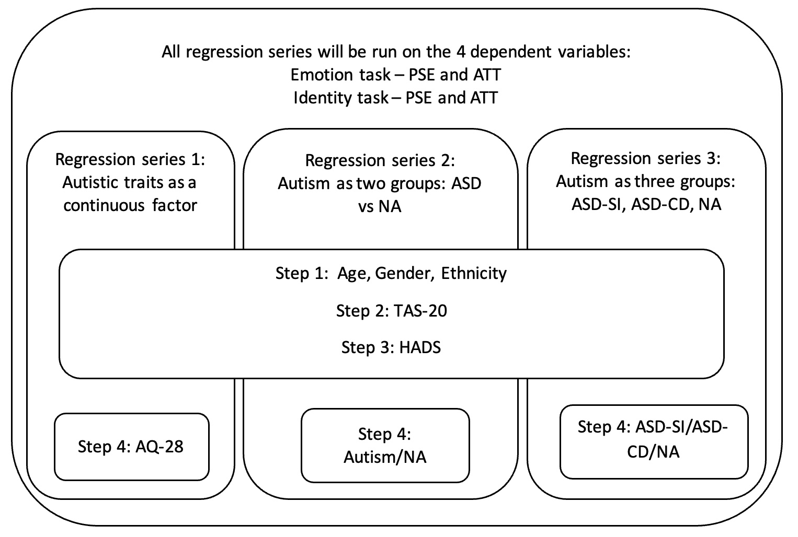

```{r setup, include=FALSE}

packagelist <- c('pwr','rstatix','kableExtra','lm.beta','coin')
missingpackages <- packagelist[!packagelist %in% installed.packages()[,1]]
if (length(missingpackages)>0){install.packages(missingpackages)}
toinstall <- packagelist[which(!packagelist %in% (.packages()))]
invisible(lapply(toinstall,library,character.only=TRUE))

knitr::opts_chunk$set(echo = FALSE, include=TRUE)

data <- read.csv('OSF_v3 both groups all data.csv')

TD <- subset(data,Group_NTorASC==0)
ASC <- subset(data,Group_NTorASC==1)

cookthresh <- 0.022

```

```{r regseries1}

# stepwise regression series 1

# Emotion Attribution DV
#define model with all predictors
all <- lm(EMOATTINV ~ AGE + Dum_male + Dum_other + Dum_Asian + Dum_Mixed + Dum_Black + TASTOTAL + HANX7 + HDEP7 + AQ, data=data)

# exclude outliers using cook's distance threshold
CD <- cooks.distance(all)
i <- which(CD<cookthresh)
data_EA <- data[i,]

# intercept only (null) model
EAmodel0 <- lm(EMOATTINV ~ 1, data=data_EA)

# first stepwise entry
EAmodel1 <- lm(EMOATTINV ~ AGE + Dum_male + Dum_other + Dum_Asian + Dum_Mixed + Dum_Black, data=data_EA)

# second stepwise entry
EAmodel2 <- lm(EMOATTINV ~ AGE + Dum_male + Dum_other + Dum_Asian + Dum_Mixed + Dum_Black + TASTOTAL, data=data_EA)

# third stepwise entry
EAmodel3 <- lm(EMOATTINV ~ AGE + Dum_male + Dum_other + Dum_Asian + Dum_Mixed + Dum_Black + TASTOTAL + HANX7 + HDEP7, data=data_EA)

# fourth stepwise entry
EAmodel4 <- lm(EMOATTINV ~ AGE + Dum_male + Dum_other + Dum_Asian + Dum_Mixed + Dum_Black + TASTOTAL + HANX7 + HDEP7 + AQ, data=data_EA)


# Identity Attribution DV
#define model with all predictors
all <- lm(IDATTINV ~ AGE + Dum_male + Dum_other + Dum_Asian + Dum_Mixed + Dum_Black + TASTOTAL + HANX7 + HDEP7 + AQ, data=data)

# exclude outliers using cook's distance threshold
CD <- cooks.distance(all)
i <- which(CD<cookthresh)
data_IA <- data[i,]

# intercept only (null) model
IAmodel0 <- lm(IDATTINV ~ 1, data=data_IA)

# first stepwise entry
IAmodel1 <- lm(IDATTINV ~ AGE + Dum_male + Dum_other + Dum_Asian + Dum_Mixed + Dum_Black, data=data_IA)

# second stepwise entry
IAmodel2 <- lm(IDATTINV ~ AGE + Dum_male + Dum_other + Dum_Asian + Dum_Mixed + Dum_Black + TASTOTAL, data=data_IA)

# third stepwise entry
IAmodel3 <- lm(IDATTINV ~ AGE + Dum_male + Dum_other + Dum_Asian + Dum_Mixed + Dum_Black + TASTOTAL + HANX7 + HDEP7, data=data_IA)

# fourth stepwise entry
IAmodel4 <- lm(IDATTINV ~ AGE + Dum_male + Dum_other + Dum_Asian + Dum_Mixed + Dum_Black + TASTOTAL + HANX7 + HDEP7 + AQ, data=data_IA)


# Emotion PSE DV
#define model with all predictors
all <- lm(EMOPSE ~ AGE + Dum_male + Dum_other + Dum_Asian + Dum_Mixed + Dum_Black + TASTOTAL + HANX7 + HDEP7 + AQ, data=data)

# exclude outliers using cook's distance threshold
CD <- cooks.distance(all)
i <- which(CD<cookthresh)
data_EP <- data[i,]

# intercept only (null) model
EPmodel0 <- lm(EMOPSE ~ 1, data=data_EP)

# first stepwise entry
EPmodel1 <- lm(EMOPSE ~ AGE + Dum_male + Dum_other + Dum_Asian + Dum_Mixed + Dum_Black, data=data_EP)

# second stepwise entry
EPmodel2 <- lm(EMOPSE ~ AGE + Dum_male + Dum_other + Dum_Asian + Dum_Mixed + Dum_Black + TASTOTAL, data=data_EP)

# third stepwise entry
EPmodel3 <- lm(EMOPSE ~ AGE + Dum_male + Dum_other + Dum_Asian + Dum_Mixed + Dum_Black + TASTOTAL + HANX7 + HDEP7, data=data_EP)

# fourth stepwise entry
EPmodel4 <- lm(EMOPSE ~ AGE + Dum_male + Dum_other + Dum_Asian + Dum_Mixed + Dum_Black + TASTOTAL + HANX7 + HDEP7 + AQ, data=data_EP)


# Identity PSE DV
#define model with all predictors
all <- lm(IDPSE ~ AGE + Dum_male + Dum_other + Dum_Asian + Dum_Mixed + Dum_Black + TASTOTAL + HANX7 + HDEP7 + AQ, data=data)

# exclude outliers using cook's distance threshold
CD <- cooks.distance(all)
i <- which(CD<cookthresh)
data_IP <- data[i,]

# intercept only (null) model
IPmodel0 <- lm(IDPSE ~ 1, data=data_IP)

# first stepwise entry
IPmodel1 <- lm(IDPSE ~ AGE + Dum_male + Dum_other + Dum_Asian + Dum_Mixed + Dum_Black, data=data_IP)

# second stepwise entry
IPmodel2 <- lm(IDPSE ~ AGE + Dum_male + Dum_other + Dum_Asian + Dum_Mixed + Dum_Black + TASTOTAL, data=data_IP)

# third stepwise entry
IPmodel3 <- lm(IDPSE ~ AGE + Dum_male + Dum_other + Dum_Asian + Dum_Mixed + Dum_Black + TASTOTAL + HANX7 + HDEP7, data=data_IP)

# fourth stepwise entry
IPmodel4 <- lm(IDPSE ~ AGE + Dum_male + Dum_other + Dum_Asian + Dum_Mixed + Dum_Black + TASTOTAL + HANX7 + HDEP7 + AQ, data=data_IP)

```

```{r regseries2}

# stepwise regression series 2

# Emotion Attribution DV
#define model with all predictors
all <- lm(EMOATTINV ~ AGE + Dum_male + Dum_other + Dum_Asian + Dum_Mixed + Dum_Black + TASTOTAL + HANX7 + HDEP7 + Group_NTorASC, data=data)

# exclude outliers using cook's distance threshold
CD <- cooks.distance(all)
i <- which(CD<cookthresh)
data_EA2 <- data[i,]

# intercept only (null) model
EAmodel0b <- lm(EMOATTINV ~ 1, data=data_EA2)

# first stepwise entry
EAmodel1b <- lm(EMOATTINV ~ AGE + Dum_male + Dum_other + Dum_Asian + Dum_Mixed + Dum_Black, data=data_EA2)

# second stepwise entry
EAmodel2b <- lm(EMOATTINV ~ AGE + Dum_male + Dum_other + Dum_Asian + Dum_Mixed + Dum_Black + TASTOTAL, data=data_EA2)

# third stepwise entry
EAmodel3b <- lm(EMOATTINV ~ AGE + Dum_male + Dum_other + Dum_Asian + Dum_Mixed + Dum_Black + TASTOTAL + HANX7 + HDEP7, data=data_EA2)

# fourth stepwise entry
EAmodel4b <- lm(EMOATTINV ~ AGE + Dum_male + Dum_other + Dum_Asian + Dum_Mixed + Dum_Black + TASTOTAL + HANX7 + HDEP7 + Group_NTorASC, data=data_EA2)


# Identity Attribution DV
#define model with all predictors
all <- lm(IDATTINV ~ AGE + Dum_male + Dum_other + Dum_Asian + Dum_Mixed + Dum_Black + TASTOTAL + HANX7 + HDEP7 + Group_NTorASC, data=data)

# exclude outliers using cook's distance threshold
CD <- cooks.distance(all)
i <- which(CD<cookthresh)
data_IA2 <- data[i,]

# intercept only (null) model
IAmodel0b <- lm(IDATTINV ~ 1, data=data_IA2)

# first stepwise entry
IAmodel1b <- lm(IDATTINV ~ AGE + Dum_male + Dum_other + Dum_Asian + Dum_Mixed + Dum_Black, data=data_IA2)

# second stepwise entry
IAmodel2b <- lm(IDATTINV ~ AGE + Dum_male + Dum_other + Dum_Asian + Dum_Mixed + Dum_Black + TASTOTAL, data=data_IA2)

# third stepwise entry
IAmodel3b <- lm(IDATTINV ~ AGE + Dum_male + Dum_other + Dum_Asian + Dum_Mixed + Dum_Black + TASTOTAL + HANX7 + HDEP7, data=data_IA2)

# fourth stepwise entry
IAmodel4b <- lm(IDATTINV ~ AGE + Dum_male + Dum_other + Dum_Asian + Dum_Mixed + Dum_Black + TASTOTAL + HANX7 + HDEP7 + Group_NTorASC, data=data_IA2)


# Emotion PSE DV
#define model with all predictors
all <- lm(EMOPSE ~ AGE + Dum_male + Dum_other + Dum_Asian + Dum_Mixed + Dum_Black + TASTOTAL + HANX7 + HDEP7 + Group_NTorASC, data=data)

# exclude outliers using cook's distance threshold
CD <- cooks.distance(all)
i <- which(CD<cookthresh)
data_EP2 <- data[i,]

# intercept only (null) model
EPmodel0b <- lm(EMOPSE ~ 1, data=data_EP2)

# first stepwise entry
EPmodel1b <- lm(EMOPSE ~ AGE + Dum_male + Dum_other + Dum_Asian + Dum_Mixed + Dum_Black, data=data_EP2)

# second stepwise entry
EPmodel2b <- lm(EMOPSE ~ AGE + Dum_male + Dum_other + Dum_Asian + Dum_Mixed + Dum_Black + TASTOTAL, data=data_EP2)

# third stepwise entry
EPmodel3b <- lm(EMOPSE ~ AGE + Dum_male + Dum_other + Dum_Asian + Dum_Mixed + Dum_Black + TASTOTAL + HANX7 + HDEP7, data=data_EP2)

# fourth stepwise entry
EPmodel4b <- lm(EMOPSE ~ AGE + Dum_male + Dum_other + Dum_Asian + Dum_Mixed + Dum_Black + TASTOTAL + HANX7 + HDEP7 + Group_NTorASC, data=data_EP2)


# Identity PSE DV
#define model with all predictors
all <- lm(IDPSE ~ AGE + Dum_male + Dum_other + Dum_Asian + Dum_Mixed + Dum_Black + TASTOTAL + HANX7 + HDEP7 + Group_NTorASC, data=data)

# exclude outliers using cook's distance threshold
CD <- cooks.distance(all)
i <- which(CD<cookthresh)
data_IP2 <- data[i,]

# intercept only (null) model
IPmodel0b <- lm(IDPSE ~ 1, data=data_IP2)

# first stepwise entry
IPmodel1b <- lm(IDPSE ~ AGE + Dum_male + Dum_other + Dum_Asian + Dum_Mixed + Dum_Black, data=data_IP2)

# second stepwise entry
IPmodel2b <- lm(IDPSE ~ AGE + Dum_male + Dum_other + Dum_Asian + Dum_Mixed + Dum_Black + TASTOTAL, data=data_IP2)

# third stepwise entry
IPmodel3b <- lm(IDPSE ~ AGE + Dum_male + Dum_other + Dum_Asian + Dum_Mixed + Dum_Black + TASTOTAL + HANX7 + HDEP7, data=data_IP2)

# fourth stepwise entry
IPmodel4b <- lm(IDPSE ~ AGE + Dum_male + Dum_other + Dum_Asian + Dum_Mixed + Dum_Black + TASTOTAL + HANX7 + HDEP7 + Group_NTorASC, data=data_IP2)

```

```{r regseries3}

# stepwise regression series 3

# Emotion Attribution DV
#define model with all predictors
all <- lm(EMOATTINV ~ AGE + Dum_male + Dum_other + Dum_Asian + Dum_Mixed + Dum_Black + TASTOTAL + HANX7 + HDEP7 + Dum_FormalDiag + Dum_SelfDiag, data=data)

# exclude outliers using cook's distance threshold
CD <- cooks.distance(all)
i <- which(CD<cookthresh)
data_EA3 <- data[i,]

# intercept only (null) model
EAmodel0c <- lm(EMOATTINV ~ 1, data=data_EA3)

# first stepwise entry
EAmodel1c <- lm(EMOATTINV ~ AGE + Dum_male + Dum_other + Dum_Asian + Dum_Mixed + Dum_Black, data=data_EA3)

# second stepwise entry
EAmodel2c <- lm(EMOATTINV ~ AGE + Dum_male + Dum_other + Dum_Asian + Dum_Mixed + Dum_Black + TASTOTAL, data=data_EA3)

# third stepwise entry
EAmodel3c <- lm(EMOATTINV ~ AGE + Dum_male + Dum_other + Dum_Asian + Dum_Mixed + Dum_Black + TASTOTAL + HANX7 + HDEP7, data=data_EA3)

# fourth stepwise entry
EAmodel4c <- lm(EMOATTINV ~ AGE + Dum_male + Dum_other + Dum_Asian + Dum_Mixed + Dum_Black + TASTOTAL + HANX7 + HDEP7 + Dum_FormalDiag + Dum_SelfDiag, data=data_EA3)


# Identity Attribution DV
#define model with all predictors
all <- lm(IDATTINV ~ AGE + Dum_male + Dum_other + Dum_Asian + Dum_Mixed + Dum_Black + TASTOTAL + HANX7 + HDEP7 + Dum_FormalDiag + Dum_SelfDiag, data=data)

# exclude outliers using cook's distance threshold
CD <- cooks.distance(all)
i <- which(CD<cookthresh)
data_IA3 <- data[i,]

# intercept only (null) model
IAmodel0c <- lm(IDATTINV ~ 1, data=data_IA3)

# first stepwise entry
IAmodel1c <- lm(IDATTINV ~ AGE + Dum_male + Dum_other + Dum_Asian + Dum_Mixed + Dum_Black, data=data_IA3)

# second stepwise entry
IAmodel2c <- lm(IDATTINV ~ AGE + Dum_male + Dum_other + Dum_Asian + Dum_Mixed + Dum_Black + TASTOTAL, data=data_IA3)

# third stepwise entry
IAmodel3c <- lm(IDATTINV ~ AGE + Dum_male + Dum_other + Dum_Asian + Dum_Mixed + Dum_Black + TASTOTAL + HANX7 + HDEP7, data=data_IA3)

# fourth stepwise entry
IAmodel4c <- lm(IDATTINV ~ AGE + Dum_male + Dum_other + Dum_Asian + Dum_Mixed + Dum_Black + TASTOTAL + HANX7 + HDEP7 + Dum_FormalDiag + Dum_SelfDiag, data=data_IA3)


# Emotion PSE DV
#define model with all predictors
all <- lm(EMOPSE ~ AGE + Dum_male + Dum_other + Dum_Asian + Dum_Mixed + Dum_Black + TASTOTAL + HANX7 + HDEP7 + Dum_FormalDiag + Dum_SelfDiag, data=data)

# exclude outliers using cook's distance threshold
CD <- cooks.distance(all)
i <- which(CD<cookthresh)
data_EP3 <- data[i,]

# intercept only (null) model
EPmodel0c <- lm(EMOPSE ~ 1, data=data_EP3)

# first stepwise entry
EPmodel1c <- lm(EMOPSE ~ AGE + Dum_male + Dum_other + Dum_Asian + Dum_Mixed + Dum_Black, data=data_EP3)

# second stepwise entry
EPmodel2c <- lm(EMOPSE ~ AGE + Dum_male + Dum_other + Dum_Asian + Dum_Mixed + Dum_Black + TASTOTAL, data=data_EP3)

# third stepwise entry
EPmodel3c <- lm(EMOPSE ~ AGE + Dum_male + Dum_other + Dum_Asian + Dum_Mixed + Dum_Black + TASTOTAL + HANX7 + HDEP7, data=data_EP3)

# fourth stepwise entry
EPmodel4c <- lm(EMOPSE ~ AGE + Dum_male + Dum_other + Dum_Asian + Dum_Mixed + Dum_Black + TASTOTAL + HANX7 + HDEP7 + Dum_FormalDiag + Dum_SelfDiag, data=data_EP3)


# Identity PSE DV
#define model with all predictors
all <- lm(IDPSE ~ AGE + Dum_male + Dum_other + Dum_Asian + Dum_Mixed + Dum_Black + TASTOTAL + HANX7 + HDEP7 + Dum_FormalDiag + Dum_SelfDiag, data=data)

# exclude outliers using cook's distance threshold
CD <- cooks.distance(all)
i <- which(CD<cookthresh)
data_IP3 <- data[i,]

# intercept only (null) model
IPmodel0c <- lm(IDPSE ~ 1, data=data_IP3)

# first stepwise entry
IPmodel1c <- lm(IDPSE ~ AGE + Dum_male + Dum_other + Dum_Asian + Dum_Mixed + Dum_Black, data=data_IP3)

# second stepwise entry
IPmodel2c <- lm(IDPSE ~ AGE + Dum_male + Dum_other + Dum_Asian + Dum_Mixed + Dum_Black + TASTOTAL, data=data_IP3)

# third stepwise entry
IPmodel3c <- lm(IDPSE ~ AGE + Dum_male + Dum_other + Dum_Asian + Dum_Mixed + Dum_Black + TASTOTAL + HANX7 + HDEP7, data=data_IP3)

# fourth stepwise entry
IPmodel4c <- lm(IDPSE ~ AGE + Dum_male + Dum_other + Dum_Asian + Dum_Mixed + Dum_Black + TASTOTAL + HANX7 + HDEP7 + Dum_FormalDiag + Dum_SelfDiag, data=data_IP3)

```

Corresponding author: Natasha Baxter

Email: [nb1139@york.ac.uk](nb1139@york.ac.uk)

Postal Address: Natasha Baxter, Department of Psychology, University of York, York, YO10 5DD

# Abstract {.unnumbered}

Facial emotion recognition is considered atypical in individuals with autism spectrum conditions (ASC), but emotion recognition abilities vary widely in autistic people, and there are inconsistent findings on the causes of these differences. Research indicates alexithymia may result in facial emotion recognition differences in ASC. Alternatively, mood disorders have been linked to atypical facial emotional expression recognition abilities in neurotypical adults. Research investigating both the effects of alexithymia and mood disorders (depression and anxiety) is necessary to establish which of these factors may cause atypical facial emotion recognition in ASC. This study aimed to examine whether alexithymia or mood disorder symptomology is a predictor of atypical facial emotion recognition in individuals with ASC. Ninety eight non-autistic adults and 80 autistic adults were recruited. Participants completed an online facial processing task to examine emotion and identity recognition abilities, the AQ-28, the TAS-20, and the HADS to measure autism severity, alexithymia symptoms, and depression and anxiety symptoms. Regression-based analyses found that autistic traits and autistic group membership did not predict face processing abilities after accounting for demographic variables, alexithymia and mood disorder symptomatology: however, neither alexithymia nor mood disorder symptoms predicted variance in face processing abilities either. Analyses using a newly proposed reduced TAS measure did not change these findings, neither did analyses that considered the role of self-identification of autism versus formal diagnosis. Our results concur with previous meta-analyses of face processing in autism spectrum disorder which report that studies do not always report deficits in face processing in autism: our findings are also not supportive of the model that argues that alexithymia explains face processing difficulties in autism.


*Key words- Autism Spectrum Disorder, Facial Emotion Recognition, Alexithymia, Depression, Anxiety*. 

# Introduction {.unnumbered}

One of the core features of Autism Spectrum Conditions (hereafter ASC) is atypical social communication. The nature of these differences has been argued to include problems with facial processing and decreased ability in recognising other individuals’ emotions from their facial expressions, which can cause difficulties in socio-emotional abilities [@ko2018a; @loth2018a]. Indeed, previous research suggests that facial emotion recognition in autistic individuals may be reduced or atypical, relative to neurotypical individuals [@nomi2015a]. 

However, research on facial emotion recognition in autism has provided inconsistent results. Some studies have found that there is a reduced accuracy in identifying emotions, particularly negative emotions [@ashwin2006a; @bal2010a; @corden2008a; @howard2000a; @wallace2008a; @uljarevic2013a]. Meanwhile, other research has shown that in groups of individuals with ASC without intellectual disability, facial emotion recognition does not seem to be impaired [@adolphs2001a; @baron-cohen1997a; @loveland2008a; @neumann2006a; @ogai2003a; @rutherford2008a; @teunisse2001a]. Meta-analyses have however suggested that sample IQ does not determine whether an emotion recognition deficit is observed [@uljarevic2013a]; this same analysis concluded that while there was evidence for decreased emotion recognition abilities in ASC, there was evidence of publication bias and substantial heterogeneity. 

This heterogeneity of research findings may reflect heterogeneity within the autistic population with regards to emotion processing. While a study by @loth2018a indicated that the majority of individuals with ASC have atypical facial expression recognition, some do not display these differences. Therefore, further research is required to establish the differences between those individuals with ASC displaying facial emotion recognition impairments and those who do not display atypical emotion recognition [@sato2017a]. Candidate factors that could differentiate those with autism and emotion recognition differences from autistic individuals without these problems include alexithymia or mood disorders. 

## Alexithymia, mood disorders and emotion recognition in ASC {.unnumbered}

Recent research suggests that alexithymia may play a role in facial emotion recognition in ASC. Alexithymia is characterised by the inability to identify emotions experienced by the self and others [@sifneos1973a], and frequently co-occurs with ASC. @oakley2020a report that many individuals with ASC report higher levels of alexithymia, with 47.3\% of autistic females and 21.0\% of autistic males meeting the cut-off for clinically relevant alexithymia. @kinnaird2019a suggest that emotional processing differences in ASC may reflect co-occurring alexithymia and that while alexithymia is common in ASC, it is not universal, which reflects the heterogenous nature of ASC. Alexithymia has been linked to atypical activation of the anterior insula, and in fMRI studies investigating empathy in ASC, hypo-activation of the anterior insula was associated with difficulties in emotional awareness [@silani2008a]. This suggests there may even be differences at the neural level between neurotypical individuals, and those with ASC, which may lead to variation in their ability to perform emotion-related tasks.

The effect of alexithymia on emotion recognition has been investigated but mixed results have been found. @cook2013a found that autism severity was unrelated to expression-recognition ability, while alexithymia predicted facial emotion recognition abilities. This suggests co-occurring alexithymia may be responsible for atypical facial emotional expression recognition in ASC. However, @shah2019a challenges whether alexithymia plays a role in atypical emotional processing in autism. They found that autistic traits was more of a predictor than alexithymia of atypical empathy. However, given that they looked at empathy, rather than emotional processing, this point of difference between these two papers could be due the focus on different socio-emotional abilities: future research is needed to clarify the effect of alexithymia on emotional face processing and empathy. 

Additionally, the conflicting findings may be explained by the different research designs employed by the researchers. @shah2019a argues that a matched approach, such as that used by @cook2013a, can suffer from biased sampling. In the case of alexithymia research, a biased sample can occur when using a matched design as alexithymia is more present in autistic populations compared to non-autistic populations (50\% versus 5\%, @kinnaird2019a). As the prevalence of alexithymia in the autistic population is considerably higher than in the typically developed population, Cook et al.’s control sample does not match the proportion of alexithymia in the population, and can be considered to have a high number of people with high alexithymia traits in the non-clinical sample, and these high levels of alexithymia may be linked to other factors that influence the research such as interpersonal issues and mental health conditions.  @shah2019a states that matched groups are difficult to be truly representative of their respective populations and that this can result in inaccurate statistical comparisons and population-level inferences. Furthermore,  @shah2019a noted issues within this field of research such as small sample sizes lacking statistical power. They conclude that larger samples with sufficient statistical power examining the potential predictors of atypical emotional abilities in autism would be beneficial to future research.  

There are additional issues with alexithymia and autism research, regarding the measures used to measure these constructs. As discussed in @ruzich2015a, while the AQ measures are commonly used in research and in practice as screening instruments, arguably this measure does not have suitable sensitivity and specificity for population screening of autism per se. Thus, those who score “above threshold” on the AQ may not be considered “autistic”. Furthermore, there have been issues with incorrect cut-off values being used for the AQ-10, and this has had implications for research, as it significantly affected the effect sizes reported by research into the relationship between autism and behaviours of interest [@waldren2022a]. This suggests that researchers must be aware that thresholds may be too lenient (or stringent), and ensure that the correct threshold is used appropriately. In addition, the psychometric properties of the original TAS-20 alexithymia measure have been questioned: while the TAS-20 has been argued to be a reliable measure of alexithymia in typically developed and clinical populations [@bagby1994a; @bagby1994a; @cook2013a], others have argued the original proposed TAS-20 model was not adequate for either autistic or typically developed populations [@williams2021a]. @williams2021a used the factor analysis to reduce the items of the TAS-20 to eight items (the 8-item general alexithymia factor score, the GAFS-8), and found sound psychometric properties and that the GAFS-8 did predict alexithymia traits without any deficiencies in validity. This suggests that the GAFS-8 may be a more suitable measure to be used instead of the TAS-20, but there has yet to be investigation into how these measures compare in their prediction of socioemotional abilities, such as emotional face recognition. 

There are other factors that may be responsible for emotion recognition differences in ASC such as mood disorders including anxiety and depression. Mental health conditions such as depression and anxiety are common in autism, the lifetime prevalence being estimated at 42\% for anxiety and 37\% for depression [@hollocks2019a; @skokauskas2010a]. Research has shown that depression and anxiety are associated with atypical facial emotional expression recognition abilities in non-autistic adults [@demenescu2010a; @skokauskas2010a; @stewart2006a]. @demenescu2010a found that adults with anxiety displayed significant decreased abilities in emotional expression recognition (Cohen's d=-0.35) and that depression was associated with a larger display of decreased ability in emotion recognition (d=-0.58). Additionally, @torro-alves2016a found that individuals with high social anxiety had poorer facial emotion recognition particularly in ambiguous and low intensity presentations of facial emotional stimuli. While there is research establishing the prevalence of anxiety and depression, there is a paucity of research specifically investigating the effect of depression and anxiety on facial emotion recognition abilities in autistic individuals. Potentially, depression and anxiety will affect facial emotion recognition in a similar way to non-autistic individuals, but whether they have an independent effect or exacerbate existing atypical facial emotion recognition in ASC requires investigation [@oakley2020a]. 

Mood disorders and alexithymia may also interact in ASC, and there is existing evidence to suggest relationships between depression, anxiety and alexithymia. Alexithymia and mood disorders have a close relationship, as alexithymia may be related to atypical emotion regulation, and evidence suggests alexithymia may mediate the relationship between anxiety, depression, and autism [@morie2019a; @venta2013a]. Indeed, as research demonstrates that both alexithymia and mood disorders have overlapping symptomology and are often co-occurring, the distinctness of the traits of these conditions and how they can be effectively measures is questioned. However, research by @marchesi2000a has clarified that alexithymia, anxiety and depression are separate constructs through a factor analysis of the TAS-20 [Toronto Alexithymia Scale, @bagby1994a] and the HADS [the Hospital Anxiety and Depression scale, @zigmond1983a]. 

Alexithymia has been shown to be high in autistic individuals, but is also associated with mood disorders such as anxiety and depression in those without ASC [@honkalampi2000a; @karukivi2010a]. The relationship between alexithymia and co-occurring depression or anxiety may be explained by evidence suggesting individuals with these co-occurring conditions have lower emotional intelligence, which may also have implications for differences in facial emotion recognition abilities [@onur2013a]. @morie2019a suggest that individuals with ASC are more likely than the neurotypical population to have alexithymia, and that alexithymia may affect emotional processes (such as regulation), leading to increased possibility of mood disorders. Whether alexithymia or a mood disorder then contributes to atypical emotion recognition in ASC is of interest to the current study.  

While evidence suggests alexithymia and mood disorders are related to atypical facial emotion recognition, more research is needed to establish the independent effects alexithymia, mood disorders, and traits of ASC have on facial emotion recognition. Additionally, research into alexithymia and mood disorders in autism will provide insights that could help tailor interventions [@kinnaird2019a].

@berggren2018a conducted a systematic review investigating emotion recognition training for autistic individuals. They found that while emotion recognition training improved emotion recognition in some of the studies, the generalisability of the training to normal daily life and social activities was unclear. While emotion recognition training likely benefits some individuals, perhaps targeting differences in emotion recognition is not effective for all. Indeed, if mood disorder symptomatology is highly predictive of atypical emotion recognition in autism, this would question the approach of interventions that train emotion recognition, instead suggesting that interventions targeting depression or anxiety would be perhaps doubly effective, in both relieving the mood disorder symptoms, and having positive effects on social emotional cognition. 

## Aims of this study {.unnumbered}

The aim of this study is to investigate the extent to which co-occurring alexithymia and/or a mood disorder symptomatology predict atypical facial emotion recognition in individuals with autism. Previous research indicates that alexithymia has an effect on facial emotion recognition abilities in autism [@cook2013a]. However, research investigating the effects of mood disorders has mainly focused on typically developed samples. Therefore, for this study we aim to use both a sample of adults with ASC and a sample of non-autistic adults as our sample to establish the effects of anxiety and depression on facial emotion recognition abilities. 

Our research is based on a study by @cook2013a, in which they investigated co-occurring alexithymia and facial emotion recognition ability in individuals with autism, finding that autism severity was not related to expression recognition while alexithymia correlated strongly. We aim to replicate their findings with alexithymia but also investigate whether co-morbid mood disorders such as anxiety and depression may account for the differences in facial emotion expression recognition, specifically the ability to distinguish disgust from anger. Additionally, as alexithymia, anxiety and depression have overlapping traits (one can also argue that ASC has some overlapping symptomology as well), whether a combination of both alexithymia and mood disorders further exacerbates atypical emotion recognition is of interest. 

# Method {.unnumbered}

## Pre-existing non-autistic data {.unnumbered}

Our project includes data from both non-autistic and autistic individuals. In order to establish the feasibility of the task and procedure, the non-autistic data were  collected in accordance with a preregistered protocol (available to view here: https://osf.io/wjvne), prior to registration with the journal. Our methodological details here encompass both what was collected for non-autistic and autistic participant group. While we used comparable tasks and measures to those of @cook2013a, as noted by @shah2019a there are problems with a matched group approach to alexithymia research, and thus we opted to recruit a large sample and use regression-based analyses to ensure we have sufficient power and can examine the predictors of atypical facial emotion processing. 

## Participants {.unnumbered}

The non-autistic group was recruited via social media, ‘word of mouth’, and via Prolific. We aimed to collect 100 non-autistic participants, and had 119 complete datasets. However, 21 were removed due to being incomplete, or failing an attention check measure. This means that data from a sample of `r nrow(TD)` non-autistic adults was been collected in a previous study using the same methods, materials and experimental design. This sample serves as a comparison group to the autistic sample. For the preliminary results drawn from the non-autistic group only (and which featured in the Stage 1 version of this report) see “Results from the non-autistic sample – Preregistered analyses” in the Supplementary Materials.

To be comparable to the data collected from this control group, we aimed to collect complete datasets from at least 100 autistic people (see our Power analysis section for considerations on potential data loss). During data collection, it was discovered that a number of recruited individuals were suspected to be fraudulent participants: this was due to an autism organization sharing the online link to take part in the study directly without having to contact the research team. Data gathered during this period of recruitment is not included in the study as a high number of participants’ emails and addresses (collected for reimbursement purposes) were deemed to be suspicious. This unfortunately had a knock on effect on our ability to meet out intended recruitment target, due to resource constraints. In the end, we successfully collected `r nrow(ASC)` autistic data sets. Even when outliers were removed, we achieved our minimum power requirements for 73 autistic datasets for each regression conducted.

Similar methods were used to recruit our autistic sample, with the exception of Prolific, plus via the Autistica research network. Participants needed to be aged 18 years and over. Both participants with clinically diagnosed ASC or those who self-identify as autistic were welcomed into the study: we recognise that for certain individuals a formal diagnosis can be hard to obtain, especially in adults and females, as females tend to present differently to males, and ASC may be ‘missed’ in adults who were not identified as children [@gould2011a; @murphy2016a]. Therefore, we invited invite both individuals who self-identify as autistic, and those who have received a formal diagnosis to participate. Participants were asked whether they have received a formal diagnosis or self-identify as autistic, to establish whether self-identification is associated with our variables of interest. 

Table \@ref(tab:table1) summarises the participants’ characteristics. 

``` {r table1}

table1data <- data.frame(matrix(0,nrow=20,ncol=4))

table1data[1,] <- c('','Full Sample','Autistic Sample','Non-autistic Sample')
table1data[2,] <- c('',paste0('(N = ',nrow(data),')'),paste0('(N = ',nrow(ASC),')'),paste0('(N = ',nrow(TD),')'))
table1data[3,] <- c('Gender',paste0('N Female = ',sum(data$GENDER=='Fema')),paste0('N Female = ',sum(ASC$GENDER=='Fema')),paste0('N Female = ',sum(TD$GENDER=='Fema')))
table1data[4,] <- c('',paste0('N Male = ',sum(data$GENDER=='Male')),paste0('N Male = ',sum(ASC$GENDER=='Male')),paste0('N Male = ',sum(TD$GENDER=='Male')))
table1data[5,] <- c('',paste0('N Other = ',sum(data$GENDER=='Othe')),paste0('N Other = ',sum(ASC$GENDER=='Othe')),paste0('N Other = ',sum(TD$GENDER=='Othe')))
table1data[7,] <- c('Age',paste0(round(mean(data$AGE),digits=2),' (',round(sd(data$AGE),digits=2),')'),paste0(round(mean(ASC$AGE),digits=2),' (',round(sd(ASC$AGE),digits=2),')'),paste0(round(mean(TD$AGE),digits=2),' (',round(sd(TD$AGE),digits=2),')'))
table1data[9,] <- c('Ethnicity',paste0('N Asian = ',sum(data$ETHNCITY=='Asian')),paste0('N Asian = ',sum(ASC$ETHNCITY=='Asian')),paste0('N Asian = ',sum(TD$ETHNCITY=='Asian')))
table1data[10,] <- c('',paste0('N Black = ',sum(data$ETHNCITY=='Black')),paste0('N Black = ',sum(ASC$ETHNCITY=='Black')),paste0('N Mixed = ',sum(TD$ETHNCITY=='mixed')))
table1data[11,] <- c('',paste0('N Mixed = ',sum(data$ETHNCITY=='mixed')),paste0('N Mixed = ',sum(ASC$ETHNCITY=='mixed')),paste0('N White = ',sum(TD$ETHNCITY=='White')))
table1data[12,] <- c('',paste0('N White = ',sum(data$ETHNCITY=='White')),paste0('N White = ',sum(ASC$ETHNCITY=='White')),'')
table1data[14,] <- c('HADS-Depression',paste0(round(mean(data$HDEP7),digits=2),' (',round(sd(data$HDEP7),digits=2),')'),paste0(round(mean(ASC$HDEP7),digits=2),' (',round(sd(ASC$HDEP7),digits=2),')'),paste0(round(mean(TD$HDEP7),digits=2),' (',round(sd(TD$HDEP7),digits=2),')'))
table1data[16,] <- c('HADS-Anxiety',paste0(round(mean(data$HANX7),digits=2),' (',round(sd(data$HANX7),digits=2),')'),paste0(round(mean(ASC$HANX7),digits=2),' (',round(sd(ASC$HANX7),digits=2),')'),paste0(round(mean(TD$HANX7),digits=2),' (',round(sd(TD$HANX7),digits=2),')'))
table1data[18,] <- c('AQ-28',paste0(round(mean(data$AQ),digits=2),' (',round(sd(data$AQ),digits=2),')'),paste0(round(mean(ASC$AQ),digits=2),' (',round(sd(ASC$AQ),digits=2),')'),paste0(round(mean(TD$AQ),digits=2),' (',round(sd(TD$AQ),digits=2),')'))
table1data[20,] <- c('TAS-20',paste0(round(mean(data$TASTOTAL),digits=2),' (',round(sd(data$TASTOTAL),digits=2),')'),paste0(round(mean(ASC$TASTOTAL),digits=2),' (',round(sd(ASC$TASTOTAL),digits=2),')'),paste0(round(mean(TD$TASTOTAL),digits=2),' (',round(sd(TD$TASTOTAL),digits=2),')'))
table1data[c(6,8,13,15,17,19),] <- ''

knitr::kable(table1data, booktabs = T, col.names = NULL, caption='Participant Characteristics.', align='llll') %>%
  row_spec(2, hline_after=T) %>%
  kable_styling(latex_options='HOLD_position') %>%
  add_footnote('For non-category data, statistics reported are means with standard deviations in parentheses.',notation='none')

```


## Tasks and materials {.unnumbered} 

*Face processing task*

Many forms of facial recognition tests and stimuli have been developed and used in previous research to measure facial emotion recognition. Our stimuli have been selected from previous research by @cook2013a, a method that allows us to establish whether emotion recognition problems are occurring in the context of more general face processing difficulties, using identical stimuli for both emotion and identity recognition tasks.

The stimuli consisted of 14 images of two morphed faces displaying anger and disgust, a technique originally developed by @calder1996a. The two cross-morph sets comprised of ‘Harold’ displaying anger to ‘Felix’ displaying disgust and ‘Harold’ displaying disgust to ‘Felix’ showing anger. The set began with 80\% intensity of ‘Harold’ displaying anger with 20\% intensity of ‘Felix’ showing disgust. The next image would then be 70\% intensity of ‘Harold’ displaying anger with 30\% intensity of ‘Felix’ showing disgust, and then increasing and decreasing respectively until 80\% intensity for Felix showing disgust and 20\% intensity for ‘Harold’ displaying anger. This was repeated for the other set consisting of ‘Harold’ showing disgust and ‘Felix’ showing anger’. A strength of these stimuli sets is that they can be used to easily control for general face processing problems by checking identity recognition, using the same stimuli for both emotion recognition and identity recognition trials. The cross-morphed stimuli also reflect real-life face and emotion processing as typically both identity and expression are attended to when encountering faces. Measuring identity recognition allowed us to determine whether alexithymia or mood disorders were having an effect on facial processing overall or just facial emotion recognition. Indeed, it has been proposed that there is a link between autism and atypical face processing as research suggests a ‘diminished level of expertise’ for processing faces [@gauthier2009a]. Of course, only including a disgust-anger morph stimuli set limits the generalizability of the findings to a wider range of emotions; because of the testing time required to gather enough data for our dependent variables, it was thought that including another contrast (e.g. fear-surprise) would likely impact on recruitment and attrition. It was thus decided to examine disgust-anger only. 

Participants first completed a training and practice phase. They were presented with 4 images in succession, Harold being angry, Harold being disgusted, Felix being angry and Felix being disgusted, with the identity and emotion presented stated underneath (e.g. “This is Harold angry”). In order to test that participants can recognise Harold and Felix, and recognise their emotions when presented at 80\% (the maximum intensity for one emotion and identity, e.g. 80\% Harold and anger, and 20\% Felix and disgust), they were then presented with the same images as before, but with the addition of the keyboard presses that participants use to respond in the experimental trials. These trials gave feedback to the participants, either a red cross indicating they were wrong or a green tick mark to indicate they were correct. They completed eight of these feedback trials. There were then 24 practise trials in the style of the experimental phase (without feedback). 

Following the training and practice phase, stimuli were presented in 10 blocks comprising of 28 experimental trials each. The 14 stimuli were presented twice within each block in random order. Trials start with a fixation cross lasting 1500ms. Stimuli are presented for 800ms and are then replaced by a prompt stating either ‘Harold or Felix?’ or ‘Disgust or Anger’? Between each block, during which participants can take a break, participants were presented with a screen showing the stimuli for the two emotions at 80\% intensity for the two individuals with clear labels for identity and expression.

*Attention check measure*

Given that this study was conducted online away from experimenter supervision, we are including a task to check participants were attending to the screen. A grey star is presented briefly (for 800ms) in certain experimental blocks (specifically blocks 2, 6, and 9). After every block, participants are asked if they saw the star. Only participants who correctly report seeing all grey stars were retained for analyses. 

*Questionnaire measures*

Self-report measures were used for capturing autistic traits, alexithymia traits and anxiety and depression symptoms.

The Hospital Anxiety and Depression scale [HADS, @zigmond1983a] consists of seven questions for anxiety and seven questions for depression. Depression and anxiety scales are scored separately. The HADS has been shown to perform well in measuring anxiety and depression symptoms in non-clinical samples as well as clinical samples [@bjelland2002a], including the identification of anxiety and depression in autistic individuals, with good internal consistency and convergent validity for both the anxiety and depression scales [@uljarevic2013a]. The means, standard deviations and distribution of the HADS data for our data from typically developed adults confirm the measure is normally distributed, with suitable variation in scores that will allow for the exploration of the impacts of anxiety and depression on our variables of interest. 

The Toronto Alexithymia Scale [TAS-20, @bagby1994a] consists of three subscales: difficulty describing feelings (reflected in 5 items), difficulty identifying feeling (7 items), and externally-oriented thinking (8 items). Research has shown that the TAS-20 has construct validity and provided evidence of the TAS-20 as a reliable measure of alexithymia [@bagby1994a]. Research also indicates it is suitable for use with individuals with ASC, showing string test re-test reliability and convergent validity with other measures such as the Bermond-Vorst Alexithymia Questionnaire [@berthoz2005a; @zech1999a]. The TAS-20 has also been previously used in autism and emotion recognition research [e.g. @cook2013a].

The abridged Autism Quotient [AQ-28, @hoekstra2011a] consists of 28 items taken from the AQ-50 [@baron-cohen2001a]. These 28 items reflect five factors: social skills, routine, switching, imagination, and recognising numbers/patterns. The abridged AQ version still retains high validity as a measure of autism symptomology [@hoekstra2011a], and we determined that a shorter version of the AQ would be suitable for our experimental design in order to decrease fatigue effects and attrition rates. 

It should be noted we are not including an IQ measure in this study. @cook2013a found no effect of IQ, and neither did the meta-analysis performed by @uljarevic2013a; thus, it was decided not to include an IQ measure. 

## Procedure {.unnumbered}

Participants read information about the study and only proceeded once consent was given. Participants who took part in the non-autistic study received the same information and consent forms. Ethical approval was given by the ethics board of the Psychology department of the University of York. 

Testing was done online using the experiment builder software ‘Gorilla’ (www.gorilla.sc). After reading the information sheet and completing the consent form, participants completed the facial emotion and identity recognition task. Participants first completed the training and feedback phase, to teach the participants what the identity and emotions shown are (‘Harold’ and ‘Felix’, disgust and anger), then 24 practise trials before beginning the main task. The training and practise trials served only to familiarise participants with the task, and as there are only a small number of practise trials we could not generate the required variables to assess participant performance. Therefore, all participants progressed to the main task after training. After completing the main task, the participants then completed a demographics questionnaire, AQ-28, TAS and HADs. They were also asked if they have been diagnosed with anxiety or depression, and whether they had been diagnosed with ASC or are self-identified. After completing these measures, the participants were debriefed and thanked for their participation. The task and measures lasted approximately 30 to 45 minutes.

## Analysis plan {.unnumbered}

Analysis were conducted using MATLAB, and SPSS statistics. The dependent variables for this experiment are the point of subjective equivalence (PSE) which is a measure of bias and details the point on the expression or identity dimension at which participants are equally likely to make either attribution (i.e. either “Harold” or “Felix”, or “Anger” or “Disgust”), and the attribution threshold which is an index of attribution precision. The attribution data was modelled by fitting cumulative Gaussian functions to estimate the psychometric functions, function fitting will be completed in MATLAB using the Palamedes tool box [@prins2018a], and separate functions for the expression and identity dimensions were modelled for each participant. The attribution threshold was based on the standard deviation of the Gaussian distribution that best fits the data. 

*Pre-registered statistical tests*

To test the contribution of autistic traits, alexithymic traits and mood disorder symptomatology to predicting emotion and identity recognition, we conducted a series of hierarchical regressions. These are summarised in Figure \@ref(fig:figure1). 

```{r figure1, out.width="80%",, fig.cap="Diagram showing the hierarchical regression series analyses. ASD-SI = self-identifying autistics, ASD-CD = clinically diagnosed autistics, NA = non-autistics,  AQ-28 = Autism Quotient, TAS-20 = Toronto Alexithymia Scale, HADS = Hospital Anxiety and Depression Scale, PSE = Point of subjective equivalence, ATT = Attribution Threshold.", fig.align="center", include=TRUE, echo=FALSE}



```

In regression series 1, we entered age, gender, and ethnicity entered as predictors in step 1 to control for these broad demographic effects on performance. In step 2, we entered our alexithymia measure (the TAS-20), and then step three included our anxiety and depressions measures (the HADS), and step 4 included our autism trait measure (the AQ-28). All self-report measures were entered as continuous variables. 

While autistic traits have been conceptualised as a continuous trait, along which both autistic and non-autistic individuals vary, it is of course possible that the extent of one’s autistic traits may not be as predictive as whether or not one has a clinically significant level of autistic traits. Regression series 2 will test this possibility, taking a categorical approach to the autism variable. In this regression, and we compared the neurotypical comparison group and the autism group in step 4.
The third regression also took a categorical approach to check if the presence of self-identified autistics influences the model-fit. In this regression series, we included three levels to our group variable: neurotypicals, self-identifying autistic participants, and autistic participants who state that they have a formal diagnosis. 

We planned to include some simple correlational analyses, descriptive statistics, and t-tests to further clarify any group differences, and directions of effect. We also examined the group differences of participants who meet the commonly used threshold for alexithymia (a score of 61 of above on the TAS-20), and those who do not, as previous research indicates we will also find a difference between these groups [@cook2013a]. This was done via a series of non-parametric tests, to explore whether those who are above the threshold are associated with higher levels of depression, anxiety, autistic traits, and poor facial emotion and identity recognition. 

Additional pre-registered analyses, which are reported in the Supplementary Materials for brevity, were also run. In an further set of regressions, the AQ-28 threshold was used to create a group of autistic participants above the threshold, and also a non-autistic group below the threshold. It seemed possible that including those who self-identify as autistic, while being inclusive of certain groups who may struggle to receive a formal diagnosis, this could affect the results, possibly reducing our effect sizes, if these individuals had reduced autistic characteristics. Therefore, using the AQ-28 threshold, we removed those with high AQ scores in the non-autistic group and those with low AQ scores in the autistic group, and thus created more differentiation between our two samples. This further allowed us to see if including the self-identifying individuals affected the results. We also ran a supplementary analysis using the TAS-8, to determine whether using this shorter alexithymia measure, which has been argued to have improved psychometric properties, can establish the role of alexithymia. Finally, we will perform an additional regression with the identified outliers included, to assess whether by removing outliers, we are also removing theoretically interesting cases as those individuals may have high traits of alexithymia and show the effect of alexithymia on emotional face processing. 

*Power analysis*

``` {r poweranalysis}

powerL <- pwr.f2.test(u = 1, f2=0.15,sig.level=0.05,power=0.9)
N <- 1 + powerL$u + ceiling(powerL$v)

powerR <- pwr.r.test(r=0.3,sig.level=0.05,power=0.8,alternative='greater')

```

A previous meta-analysis by @uljarevic2013a examined emotion recognition in ASC compared to neurotypicals. This analysis reported a large effect size before adjusting for publications bias (which then decreased to a moderate effect size). Additionally, a meta-analysis investigating alexithymia and autism found large to medium effect sizes for between groups differences (neurotypicals and autistics), suggesting a higher prevalence of alexithymia in autistic individuals [@kinnaird2019a]. Therefore, previous research indicates that we can expect at least a medium effect size, with regard to emotion recognition and alexithymia comparison between autistic and non-autistic groups. However, a key target for our own study is the extent to which independent predictors add to a model explaining emotion recognition ability, rather than straight forward group comparisons of alexithymia and emotion recognition. Previous research investigating whether alexithymia explains emotion recognition deficits in autistic and non-autistic participants reported a large effect size ($f^2$ = 0.364), this being the effect size for the variance explained by alexithymia when added to the regression model [@cook2013a]. However, given reported concerns over publication bias in emotion recognition and autism research where effects may have been inflated [@uljarevic2013a], we based our power analysis on a more moderate medium effect size.  

A priori analyses were carried out to establish the required sample size for a regression analysis, which will be our core hypothesis-testing statistical procedure. The power analysis was carried out using the software G*Power [@faul2009a], with 1 number of tested predictors and 6 total predictors, and an effect size ($f^2$) was `r powerL$f2`. This power analyses thus tests the power for a predictor to reveal a significant independent contribution to a model, over and above previous entered predictors. Results showed that a sample size of `r N` participants would be needed for a significance level of `r powerL$sig.level` and the level of power at `r powerL$power`. Also, power analyses states that a sample size of `r ceiling(powerR$n)` would be required to establish a correlation between emotion recognition and the TAS-20 (the alexithymia measure). 

Our first sample of non-autistic participants was a sample of `r nrow(TD)` participants, (7 of which were considered outliers in our preliminary analyses). We intended to collect at least 100 complete datasets from our autistic sample, and at least 90 datasets that survive removal due to attention check fails, being an outlier, or poor function fit. As noted in our Participants section above, were were unable to achieve this, but our final sample was `r nrow(data)` participants, after removing incomplete datasets and individuals who failed the attention check. This sample size should still negate any issues with multi-collinearity, and inflation of previous estimate due to publication bias. As previously noted, we included those who self-identify as autistic in our autistic sample in order to aid in recruiting our goal of at least 100 participants. Also, we did not formally checking participants for their clinical diagnosis: as we cannot verify who has a formal diagnosis of autism, we felt it practical to allow people who self-identify as autistic to take part and just ask them if they are or are not formally diagnosed.

# Results {.unnumbered}

As per our pre-registered analysis plan, we conducted all analyses with outliers excluded and included. In the below sections are the results when outliers were excluded (using a Cook’s Distance threshold of 0.022, a threshold applied for each regression independently, as Cook’s Distances are calculated for each regression separately). Please see the Supplementary Materials for Results with outliers included, but in summary when all participants were included no regression model was significant, at any step or for any dependent variable. While some predictors were correlated with each other (see Table 2), all variance inflation factors were below a conservative threshold of 2.5, meaning we had no indications of multicollinearity within the data.

``` {r table2, warning=FALSE}

table2data <- data.frame(matrix(0,nrow=14,ncol=9))

table2data[,1] <- c('','','','TAS-TOTAL','','','AQ','','','HADS Depression','','','HADS Anxiety','')
table2data[c(6,9,12),] <- ''
table2data[1,] <- c('','','','', '','', '', 'Emotion', 'Identity')
table2data[2,] <- c('','TAS-','AQ','HADS', 'HADS','Emotion PSE', 'Identity PSE', 'attribution', 'attribution')
table2data[3,] <- c('','TOTAL','','Depression','Anxiety',paste0('(N=',nrow(data_EP),')'),paste0('(N=',nrow(data_IP),')'),paste0('(N=',nrow(data_EA),')'),paste0('(N=',nrow(data_IA),')'))
table2data[4:5,2] <- ''
table2data[7:8,3] <- ''
table2data[10:11,4] <- ''
table2data[13:14,5] <- ''

cout <- cor.test(data$TASTOTAL,data$AQ,method='spearman',alternative='greater')
table2data[7,2] <- p_format(cout$estimate,digits=3,leading.zero=F)
table2data[8,2] <- p_format(cout$p.value,digits=3,accuracy=0.001,leading.zero=F,add.p=T)
table2data[4,3] <- p_format(cout$estimate,digits=3,leading.zero=F)
table2data[5,3] <- p_format(cout$p.value,digits=3,accuracy=0.001,leading.zero=F,add.p=T)

cout <- cor.test(data$TASTOTAL,data$HDEP7,method='spearman',alternative='greater')
table2data[10,2] <- p_format(cout$estimate,digits=2,leading.zero=F)
table2data[11,2] <- p_format(cout$p.value,digits=3,accuracy=0.001,leading.zero=F,add.p=T)
table2data[4,4] <- p_format(cout$estimate,digits=2,leading.zero=F)
table2data[5,4] <- p_format(cout$p.value,digits=3,accuracy=0.001,leading.zero=F,add.p=T)

cout <- cor.test(data$TASTOTAL,data$HANX7,method='spearman',alternative='less')
table2data[13,2] <- round(cout$estimate,digits=3)
table2data[14,2] <- p_format(cout$p.value,digits=3,accuracy=0.001,leading.zero=F,add.p=T)
table2data[4,5] <- round(cout$estimate,digits=3)
table2data[5,5] <- p_format(cout$p.value,digits=3,accuracy=0.001,leading.zero=F,add.p=T)

cout <- cor.test(data$AQ,data$HDEP7,method='spearman',alternative='greater')
table2data[10,3] <- p_format(cout$estimate,digits=3,leading.zero=F)
table2data[11,3] <- p_format(cout$p.value,digits=2,accuracy=0.001,leading.zero=F,add.p=T)
table2data[7,4] <- p_format(cout$estimate,digits=3,leading.zero=F)
table2data[8,4] <- p_format(cout$p.value,digits=2,accuracy=0.001,leading.zero=F,add.p=T)

cout <- cor.test(data$AQ,data$HANX7,method='spearman',alternative='less')
table2data[13,3] <- round(cout$estimate,digits=3)
table2data[14,3] <- p_format(cout$p.value,digits=3,accuracy=0.001,leading.zero=F,add.p=T)
table2data[7,5] <- round(cout$estimate,digits=3)
table2data[8,5] <- p_format(cout$p.value,digits=3,accuracy=0.001,leading.zero=F,add.p=T)

cout <- cor.test(data$HDEP7,data$HANX7,method='spearman',alternative='less')
table2data[13,4] <- round(cout$estimate,digits=3)
table2data[14,4] <- p_format(cout$p.value,digits=3,accuracy=0.001,leading.zero=F,add.p=T)
table2data[10,5] <- round(cout$estimate,digits=3)
table2data[11,5] <- p_format(cout$p.value,digits=3,accuracy=0.001,leading.zero=F,add.p=T)

cout <- cor.test(data_EP$EMOPSE,data_EP$TASTOTAL,method='spearman',alternative='greater')
table2data[4,6] <- round(cout$estimate,digits=3)
table2data[5,6] <- p_format(cout$p.value,digits=3,accuracy=0.001,leading.zero=F,add.p=T)

cout <- cor.test(data_EP$EMOPSE,data_EP$AQ,method='spearman',alternative='greater')
table2data[7,6] <- round(cout$estimate,digits=3)
table2data[8,6] <- p_format(cout$p.value,digits=3,accuracy=0.001,leading.zero=F,add.p=T)

cout <- cor.test(data_EP$EMOPSE,data_EP$HDEP7,method='spearman',alternative='greater')
table2data[10,6] <- round(cout$estimate,digits=3)
table2data[11,6] <- p_format(cout$p.value,digits=2,accuracy=0.001,leading.zero=F,add.p=T)

cout <- cor.test(data_EP$EMOPSE,data_EP$HANX7,method='spearman',alternative='greater')
table2data[13,6] <- round(cout$estimate,digits=3)
table2data[14,6] <- p_format(cout$p.value,digits=3,accuracy=0.001,leading.zero=F,add.p=T)


cout <- cor.test(data_IP$IDPSE,data_IP$TASTOTAL,method='spearman',alternative='greater')
table2data[4,7] <- round(cout$estimate,digits=3)
table2data[5,7] <- p_format(cout$p.value,digits=2,accuracy=0.001,leading.zero=F,add.p=T)

cout <- cor.test(data_IP$IDPSE,data_IP$AQ,method='spearman',alternative='greater')
table2data[7,7] <- round(cout$estimate,digits=3)
table2data[8,7] <- p_format(cout$p.value,digits=3,accuracy=0.001,leading.zero=F,add.p=T)

cout <- cor.test(data_IP$IDPSE,data_IP$HDEP7,method='spearman',alternative='greater')
table2data[10,7] <- round(cout$estimate,digits=3)
table2data[11,7] <- p_format(cout$p.value,digits=3,accuracy=0.001,leading.zero=F,add.p=T)

cout <- cor.test(data_IP$IDPSE,data_IP$HANX7,method='spearman',alternative='greater')
table2data[13,7] <- round(cout$estimate,digits=3)
table2data[14,7] <- p_format(cout$p.value,digits=3,accuracy=0.001,leading.zero=F,add.p=T)


cout <- cor.test(data_EA$EMOATTINV,data_EA$TASTOTAL,method='spearman',alternative='greater')
table2data[4,8] <- round(cout$estimate,digits=3)
table2data[5,8] <- p_format(cout$p.value,digits=3,accuracy=0.001,leading.zero=F,add.p=T)

cout <- cor.test(data_EA$EMOATTINV,data_EA$AQ,method='spearman',alternative='greater')
table2data[7,8] <- round(cout$estimate,digits=3)
table2data[8,8] <- p_format(cout$p.value,digits=2,accuracy=0.001,leading.zero=F,add.p=T)

cout <- cor.test(data_EA$EMOATTINV,data_EA$HDEP7,method='spearman',alternative='less')
table2data[10,8] <- round(cout$estimate,digits=3)
table2data[11,8] <- p_format(cout$p.value,digits=3,accuracy=0.001,leading.zero=F,add.p=T)

cout <- cor.test(data_EA$EMOATTINV,data_EA$HANX7,method='spearman',alternative='less')
table2data[13,8] <- round(cout$estimate,digits=3)
table2data[14,8] <- p_format(cout$p.value,digits=3,accuracy=0.001,leading.zero=F,add.p=T)


cout <- cor.test(data_IA$IDATTINV,data_IA$TASTOTAL,method='spearman',alternative='greater')
table2data[4,9] <- round(cout$estimate,digits=3)
table2data[5,9] <- p_format(cout$p.value,digits=3,accuracy=0.001,leading.zero=F,add.p=T)

cout <- cor.test(data_IA$IDATTINV,data_IA$AQ,method='spearman',alternative='greater')
table2data[7,9] <- round(cout$estimate,digits=3)
table2data[8,9] <- p_format(cout$p.value,digits=2,accuracy=0.001,leading.zero=F,add.p=T)

cout <- cor.test(data_IA$IDATTINV,data_IA$HDEP7,method='spearman',alternative='less')
table2data[10,9] <- round(cout$estimate,digits=3)
table2data[11,9] <- p_format(cout$p.value,digits=2,accuracy=0.001,leading.zero=F,add.p=T)

cout <- cor.test(data_IA$IDATTINV,data_IA$HANX7,method='spearman',alternative='less')
table2data[13,9] <- round(cout$estimate,digits=3)
table2data[14,9] <- p_format(cout$p.value,digits=3,accuracy=0.001,leading.zero=F,add.p=T)


knitr::kable(table2data, booktabs = T, col.names = NULL, caption='Correlations between alexithymia traits, autistic traits, depression and anxiety symptoms and face processing variables.', align='lllllllll') %>%
  row_spec(3, hline_after=T) %>%
  kable_styling(latex_options='HOLD_position',font_size=8) %>%
  add_footnote('All correlations are Spearman’s Rank and one-tailed. Note that correlations with the face processing variables are with outliers removed, as per Cook’s Distance threshold rules, generated for regression series 1 (AQ in final step).', notation='none')

```

## The role of alexithymia and autistic traits in predicting face processing {.unnumbered}

As per our analysis plan, we conducted a series of hierarchical regressions to test the roles of alexithymia versus autistic traits on face processing abilities. Figure 1 summarises the steps of our regressions. Table 2 includes the correlations between the face processing variables, depression and anxiety scores, autistic traits and alexithymic traits. 

In our first series of regressions, a continuous measure of autistic traits, the AQ28, was entered in the final step. Table \@ref(tab:table3) summarises the results of this regression series. For emotion attribution thresholds, identity attribution thresholds, and identity PSE, no model was significant at any step. For emotion PSE, the regression model was significant at steps 1s and 2 (although the addition of the TAS in step 2 did not lead to a significant increase in the variance explained). The only significant predictor was gender, specifically the dummy variable indicating “other” gender. See sub-section “The role of gender” for follow up tests on gender effects on emotion PSE. Table \@ref(tab:table4) summarises the coefficients for the regressions with significant models. 

``` {r table3}

table3data <- data.frame(matrix(0,nrow=6,ncol=9))

table3data[1,] <- c('','','F change,','','F change,','','F change,','','F change,')
table3data[2,] <- c('','F (Df), p-value','p-value','F (Df), p-value','p-value','F (Df), p-value','p-value','F (Df), p-value','p-value')
table3data[,1] <- c('','','Model 1','Model 2','Model 3','Model 4')

a <- summary(EAmodel1)
pval <- p_format(pf(a$fstatistic[1],a$fstatistic[2],a$fstatistic[3],lower.tail=FALSE), digits=3, accuracy = 0.001, leading.zero=FALSE)
table3data[3,2] <- paste0(round(a$fstatistic[1],digits=2), ' (',a$fstatistic[2],',',a$fstatistic[3],'), ',pval)

a <- summary(EAmodel2)
pval <- p_format(pf(a$fstatistic[1],a$fstatistic[2],a$fstatistic[3],lower.tail=FALSE), digits=3, accuracy = 0.001, leading.zero=FALSE)
table3data[4,2] <- paste0(round(a$fstatistic[1],digits=2), ' (',a$fstatistic[2],',',a$fstatistic[3],'), ',pval)

a <- summary(EAmodel3)
pval <- p_format(pf(a$fstatistic[1],a$fstatistic[2],a$fstatistic[3],lower.tail=FALSE), digits=3, accuracy = 0.001, leading.zero=FALSE)
table3data[5,2] <- paste0(round(a$fstatistic[1],digits=2), ' (',a$fstatistic[2],',',a$fstatistic[3],'), ',pval)

a <- summary(EAmodel4)
pval <- p_format(pf(a$fstatistic[1],a$fstatistic[2],a$fstatistic[3],lower.tail=FALSE), digits=3, accuracy = 0.001, leading.zero=FALSE)
table3data[6,2] <- paste0(round(a$fstatistic[1],digits=2), ' (',a$fstatistic[2],',',a$fstatistic[3],'), ',pval)

a <- summary(IAmodel1)
pval <- p_format(pf(a$fstatistic[1],a$fstatistic[2],a$fstatistic[3],lower.tail=FALSE), digits=3, accuracy = 0.001, leading.zero=FALSE)
table3data[3,4] <- paste0(round(a$fstatistic[1],digits=2), ' (',a$fstatistic[2],',',a$fstatistic[3],'), ',pval)

a <- summary(IAmodel2)
pval <- p_format(pf(a$fstatistic[1],a$fstatistic[2],a$fstatistic[3],lower.tail=FALSE), digits=3, accuracy = 0.001, leading.zero=FALSE)
table3data[4,4] <- paste0(round(a$fstatistic[1],digits=2), ' (',a$fstatistic[2],',',a$fstatistic[3],'), ',pval)

a <- summary(IAmodel3)
pval <- p_format(pf(a$fstatistic[1],a$fstatistic[2],a$fstatistic[3],lower.tail=FALSE), digits=3, accuracy = 0.001, leading.zero=FALSE)
table3data[5,4] <- paste0(round(a$fstatistic[1],digits=2), ' (',a$fstatistic[2],',',a$fstatistic[3],'), ',pval)

a <- summary(IAmodel4)
pval <- p_format(pf(a$fstatistic[1],a$fstatistic[2],a$fstatistic[3],lower.tail=FALSE), digits=3, accuracy = 0.001, leading.zero=FALSE)
table3data[6,4] <- paste0(round(a$fstatistic[1],digits=2), ' (',a$fstatistic[2],',',a$fstatistic[3],'), ',pval)


a <- summary(EPmodel1)
pval <- p_format(pf(a$fstatistic[1],a$fstatistic[2],a$fstatistic[3],lower.tail=FALSE), digits=2, accuracy = 0.001, leading.zero=FALSE)
table3data[3,6] <- paste0(round(a$fstatistic[1],digits=2), ' (',a$fstatistic[2],',',a$fstatistic[3],'), ',pval)

a <- summary(EPmodel2)
pval <- p_format(pf(a$fstatistic[1],a$fstatistic[2],a$fstatistic[3],lower.tail=FALSE), digits=2, accuracy = 0.001, leading.zero=FALSE)
table3data[4,6] <- paste0(round(a$fstatistic[1],digits=2), ' (',a$fstatistic[2],',',a$fstatistic[3],'), ',pval)

a <- summary(EPmodel3)
pval <- p_format(pf(a$fstatistic[1],a$fstatistic[2],a$fstatistic[3],lower.tail=FALSE), digits=2, accuracy = 0.001, leading.zero=FALSE)
table3data[5,6] <- paste0(round(a$fstatistic[1],digits=2), ' (',a$fstatistic[2],',',a$fstatistic[3],'), ',pval)

a <- summary(EPmodel4)
pval <- p_format(pf(a$fstatistic[1],a$fstatistic[2],a$fstatistic[3],lower.tail=FALSE), digits=2, accuracy = 0.001, leading.zero=FALSE)
table3data[6,6] <- paste0(round(a$fstatistic[1],digits=2), ' (',a$fstatistic[2],',',a$fstatistic[3],'), ',pval)


a <- summary(IPmodel1)
pval <- p_format(pf(a$fstatistic[1],a$fstatistic[2],a$fstatistic[3],lower.tail=FALSE), digits=3, accuracy = 0.001, leading.zero=FALSE)
table3data[3,8] <- paste0(round(a$fstatistic[1],digits=2), ' (',a$fstatistic[2],',',a$fstatistic[3],'), ',pval)

a <- summary(IPmodel2)
pval <- p_format(pf(a$fstatistic[1],a$fstatistic[2],a$fstatistic[3],lower.tail=FALSE), digits=3, accuracy = 0.001, leading.zero=FALSE)
table3data[4,8] <- paste0(round(a$fstatistic[1],digits=2), ' (',a$fstatistic[2],',',a$fstatistic[3],'), ',pval)

a <- summary(IPmodel3)
pval <- p_format(pf(a$fstatistic[1],a$fstatistic[2],a$fstatistic[3],lower.tail=FALSE), digits=3, accuracy = 0.001, leading.zero=FALSE)
table3data[5,8] <- paste0(round(a$fstatistic[1],digits=2), ' (',a$fstatistic[2],',',a$fstatistic[3],'), ',pval)

a <- summary(IPmodel4)
pval <- p_format(pf(a$fstatistic[1],a$fstatistic[2],a$fstatistic[3],lower.tail=FALSE), digits=3, accuracy = 0.001, leading.zero=FALSE)
table3data[6,8] <- paste0(round(a$fstatistic[1],digits=2), ' (',a$fstatistic[2],',',a$fstatistic[3],'), ',pval)

a <- anova(EAmodel0,EAmodel1)
table3data[3,3] <- paste0(round(a[2,5],digits=2),', ',p_format(a[2,6],digits=3,accuracy=0.001,leading.zero=F))

a <- anova(EAmodel1,EAmodel2)
table3data[4,3] <- paste0(round(a[2,5],digits=2),', ',p_format(a[2,6],digits=2,accuracy=0.001,leading.zero=F))

a <- anova(EAmodel2,EAmodel3)
table3data[5,3] <- paste0(round(a[2,5],digits=2),', ',p_format(a[2,6],digits=3,accuracy=0.001,leading.zero=F))

a <- anova(EAmodel3,EAmodel4)
table3data[6,3] <- paste0(round(a[2,5],digits=2),', ',p_format(a[2,6],digits=3,accuracy=0.001,leading.zero=F))

a <- anova(IAmodel0,IAmodel1)
table3data[3,5] <- paste0(round(a[2,5],digits=2),', ',p_format(a[2,6],digits=3,accuracy=0.001,leading.zero=F))

a <- anova(IAmodel1,IAmodel2)
table3data[4,5] <- paste0(round(a[2,5],digits=2),', ',p_format(a[2,6],digits=3,accuracy=0.001,leading.zero=F))

a <- anova(IAmodel2,IAmodel3)
table3data[5,5] <- paste0(round(a[2,5],digits=2),', ',p_format(a[2,6],digits=3,accuracy=0.001,leading.zero=F))

a <- anova(IAmodel3,IAmodel4)
table3data[6,5] <- paste0(round(a[2,5],digits=2),', ',p_format(a[2,6],digits=3,accuracy=0.001,leading.zero=F))


a <- anova(EPmodel0,EPmodel1)
table3data[3,7] <- paste0(round(a[2,5],digits=2),', ',p_format(a[2,6],digits=2,accuracy=0.001,leading.zero=F))

a <- anova(EPmodel1,EPmodel2)
table3data[4,7] <- paste0(round(a[2,5],digits=2),', ',p_format(a[2,6],digits=3,accuracy=0.001,leading.zero=F))

a <- anova(EPmodel2,EPmodel3)
table3data[5,7] <- paste0(round(a[2,5],digits=2),', ',p_format(a[2,6],digits=3,accuracy=0.001,leading.zero=F))

a <- anova(EPmodel3,EPmodel4)
table3data[6,7] <- paste0(round(a[2,5],digits=2),', ',p_format(a[2,6],digits=3,accuracy=0.001,leading.zero=F))


a <- anova(IPmodel0,IPmodel1)
table3data[3,9] <- paste0(round(a[2,5],digits=2),', ',p_format(a[2,6],digits=3,accuracy=0.001,leading.zero=F))

a <- anova(IPmodel1,IPmodel2)
table3data[4,9] <- paste0(round(a[2,5],digits=2),', ',p_format(a[2,6],digits=2,accuracy=0.001,leading.zero=F))

a <- anova(IPmodel2,IPmodel3)
table3data[5,9] <- paste0(round(a[2,5],digits=2),', ',p_format(a[2,6],digits=3,accuracy=0.001,leading.zero=F))

a <- anova(IPmodel3,IPmodel4)
table3data[6,9] <- paste0(round(a[2,5],digits=2),', ',p_format(a[2,6],digits=3,accuracy=0.001,leading.zero=F))

knitr::kable(table3data, booktabs = T, col.names = NULL, caption='Regression Series 1 (AQ entered in Step 4).', align='lllllllll') %>%
  row_spec(2, hline_after=T) %>%
 kableExtra::add_header_above(c('','Total N (ASC,TD) = 174 (77, 97)'=2,'Total N (ASC,TD) = 170 (75, 95)'=2,'Total N (ASC,TD) = 174 (77, 97)'=2,'Total N (ASC,TD) = 176 (78, 98)'=2),bold=F,align='l') %>%
  kableExtra::add_header_above(c('','Emotion Attribution'=2,'Identity Attribution'=2,'Emotion PSE'=2,'Identity PSE'=2),bold=F,align='l',line=F) %>% 
  kable_styling(latex_options='HOLD_position',font_size=5)

```

Together, these results suggest that neither autistic nor alexithymic traits explain a significant amount of variance in face processing abilities after demographic variables are accounted for. 

``` {r table4}

table4data <- data.frame(matrix(0,nrow=32,ncol=5))

colnames(table4data) <- c('Model','','Beta','t','p-value')
table4data[,1] <- ''
table4data[c(1,7,14,23),3] <- ''
table4data[c(1,7,14,23),1] <- 1:4
table4data[,2] <- c('(Constant)','Age','Male gender','Other gender','Asian ethnicity','Mixed ethnicity','(Constant)','Age','Male gender','Other gender','Asian ethnicity','Mixed ethnicity','TAS-TOTAL','(Constant)','Age','Male gender','Other gender','Asian ethnicity','Mixed ethnicity','TAS-TOTAL','HADS Anxiety','HADS Depression','(Constant)','Age','Male gender','Other gender','Asian ethnicity','Mixed ethnicity','TAS-TOTAL','HADS Anxiety','HADS Depression','AQ')

betas <- lm.beta(EPmodel1)
table4data[2:6,3] <- round(betas$standardized.coefficients[2:6],digits=3)

betas <- lm.beta(EPmodel2)
table4data[8:13,3] <- round(betas$standardized.coefficients[c(2:6,8)],digits=3)

betas <- lm.beta(EPmodel3)
table4data[15:22,3] <- round(betas$standardized.coefficients[c(2:6,8:10)],digits=3)

betas <- lm.beta(EPmodel4)
table4data[24:32,3] <- round(betas$standardized.coefficients[c(2:6,8:11)],digits=3)

vals <- summary(EPmodel1)$coefficients
table4data[1:6,4] <- round(vals[,3],digits=3)
table4data[1:6,5] <- p_format(vals[,4], digits=1, accuracy = 0.001, leading.zero=FALSE)

vals <- summary(EPmodel2)$coefficients
table4data[7:13,4] <- round(vals[,3],digits=3)
table4data[7:13,5] <- p_format(vals[,4], digits=1, accuracy = 0.001, leading.zero=FALSE)

vals <- summary(EPmodel3)$coefficients
table4data[14:22,4] <- round(vals[,3],digits=3)
table4data[14:22,5] <- p_format(vals[,4], digits=1, accuracy = 0.001, leading.zero=FALSE)

vals <- summary(EPmodel4)$coefficients
table4data[23:32,4] <- round(vals[,3],digits=3)
table4data[23:32,5] <- p_format(vals[,4], digits=1, accuracy = 0.001, leading.zero=FALSE)

knitr::kable(table4data, booktabs = T,  caption='Coefficients for Emotion PSE Regression Series 1 (AQ entered in Step 4).', align='llrrr') %>%
  kable_styling(latex_options='HOLD_position')

```

## The role of autism status and autism self-identification in predicting face processing {.unnumbered}

Further regression series were conducted, to test a) whether autism status (autistic versus non-autistic) rather than continuous autistic traits contributed to face processing ability after controlling for alexithymia, anxiety and depression and; b) whether self-identification versus clinical diagnosis of autism affected the results. 

Table \@ref(tab:table5) summarises the results of the regression series that considered the role of autistic status. For emotion attribution thresholds, identity attribution thresholds, and identity PSE, no model was significant at any step. For emotion PSE, the regression model was significant at steps 1, 2 and 4, although beyond model 1 no additional steps added significant explained variance. Table \@ref(tab:table6) summarises the coefficients for the regressions with significant models.

``` {r table5}

table5data <- data.frame(matrix(0,nrow=6,ncol=9))

table5data[1,] <- c('','','F change,','','F change,','','F change,','','F change,')
table5data[2,] <- c('','F (Df), p-value','p-value','F (Df), p-value','p-value','F (Df), p-value','p-value','F (Df), p-value','p-value')
table5data[,1] <- c('','','Model 1','Model 2','Model 3','Model 4')

a <- summary(EAmodel1b)
pval <- p_format(pf(a$fstatistic[1],a$fstatistic[2],a$fstatistic[3],lower.tail=FALSE), digits=3, accuracy = 0.001, leading.zero=FALSE)
table5data[3,2] <- paste0(round(a$fstatistic[1],digits=2), ' (',a$fstatistic[2],',',a$fstatistic[3],'), ',pval)

a <- summary(EAmodel2b)
pval <- p_format(pf(a$fstatistic[1],a$fstatistic[2],a$fstatistic[3],lower.tail=FALSE), digits=3, accuracy = 0.001, leading.zero=FALSE)
table5data[4,2] <- paste0(round(a$fstatistic[1],digits=2), ' (',a$fstatistic[2],',',a$fstatistic[3],'), ',pval)

a <- summary(EAmodel3b)
pval <- p_format(pf(a$fstatistic[1],a$fstatistic[2],a$fstatistic[3],lower.tail=FALSE), digits=3, accuracy = 0.001, leading.zero=FALSE)
table5data[5,2] <- paste0(round(a$fstatistic[1],digits=2), ' (',a$fstatistic[2],',',a$fstatistic[3],'), ',pval)

a <- summary(EAmodel4b)
pval <- p_format(pf(a$fstatistic[1],a$fstatistic[2],a$fstatistic[3],lower.tail=FALSE), digits=3, accuracy = 0.001, leading.zero=FALSE)
table5data[6,2] <- paste0(round(a$fstatistic[1],digits=2), ' (',a$fstatistic[2],',',a$fstatistic[3],'), ',pval)

a <- summary(IAmodel1b)
pval <- p_format(pf(a$fstatistic[1],a$fstatistic[2],a$fstatistic[3],lower.tail=FALSE), digits=3, accuracy = 0.001, leading.zero=FALSE)
table5data[3,4] <- paste0(round(a$fstatistic[1],digits=2), ' (',a$fstatistic[2],',',a$fstatistic[3],'), ',pval)

a <- summary(IAmodel2b)
pval <- p_format(pf(a$fstatistic[1],a$fstatistic[2],a$fstatistic[3],lower.tail=FALSE), digits=3, accuracy = 0.001, leading.zero=FALSE)
table5data[4,4] <- paste0(round(a$fstatistic[1],digits=2), ' (',a$fstatistic[2],',',a$fstatistic[3],'), ',pval)

a <- summary(IAmodel3b)
pval <- p_format(pf(a$fstatistic[1],a$fstatistic[2],a$fstatistic[3],lower.tail=FALSE), digits=3, accuracy = 0.001, leading.zero=FALSE)
table5data[5,4] <- paste0(round(a$fstatistic[1],digits=2), ' (',a$fstatistic[2],',',a$fstatistic[3],'), ',pval)

a <- summary(IAmodel4b)
pval <- p_format(pf(a$fstatistic[1],a$fstatistic[2],a$fstatistic[3],lower.tail=FALSE), digits=3, accuracy = 0.001, leading.zero=FALSE)
table5data[6,4] <- paste0(round(a$fstatistic[1],digits=2), ' (',a$fstatistic[2],',',a$fstatistic[3],'), ',pval)


a <- summary(EPmodel1b)
pval <- p_format(pf(a$fstatistic[1],a$fstatistic[2],a$fstatistic[3],lower.tail=FALSE), digits=2, accuracy = 0.001, leading.zero=FALSE)
table5data[3,6] <- paste0(round(a$fstatistic[1],digits=2), ' (',a$fstatistic[2],',',a$fstatistic[3],'), ',pval)

a <- summary(EPmodel2b)
pval <- p_format(pf(a$fstatistic[1],a$fstatistic[2],a$fstatistic[3],lower.tail=FALSE), digits=2, accuracy = 0.001, leading.zero=FALSE)
table5data[4,6] <- paste0(round(a$fstatistic[1],digits=2), ' (',a$fstatistic[2],',',a$fstatistic[3],'), ',pval)

a <- summary(EPmodel3b)
pval <- p_format(pf(a$fstatistic[1],a$fstatistic[2],a$fstatistic[3],lower.tail=FALSE), digits=2, accuracy = 0.001, leading.zero=FALSE)
table5data[5,6] <- paste0(round(a$fstatistic[1],digits=2), ' (',a$fstatistic[2],',',a$fstatistic[3],'), ',pval)

a <- summary(EPmodel4b)
pval <- p_format(pf(a$fstatistic[1],a$fstatistic[2],a$fstatistic[3],lower.tail=FALSE), digits=2, accuracy = 0.001, leading.zero=FALSE)
table5data[6,6] <- paste0(round(a$fstatistic[1],digits=2), ' (',a$fstatistic[2],',',a$fstatistic[3],'), ',pval)


a <- summary(IPmodel1b)
pval <- p_format(pf(a$fstatistic[1],a$fstatistic[2],a$fstatistic[3],lower.tail=FALSE), digits=3, accuracy = 0.001, leading.zero=FALSE)
table5data[3,8] <- paste0(round(a$fstatistic[1],digits=2), ' (',a$fstatistic[2],',',a$fstatistic[3],'), ',pval)

a <- summary(IPmodel2b)
pval <- p_format(pf(a$fstatistic[1],a$fstatistic[2],a$fstatistic[3],lower.tail=FALSE), digits=3, accuracy = 0.001, leading.zero=FALSE)
table5data[4,8] <- paste0(round(a$fstatistic[1],digits=2), ' (',a$fstatistic[2],',',a$fstatistic[3],'), ',pval)

a <- summary(IPmodel3b)
pval <- p_format(pf(a$fstatistic[1],a$fstatistic[2],a$fstatistic[3],lower.tail=FALSE), digits=3, accuracy = 0.001, leading.zero=FALSE)
table5data[5,8] <- paste0(round(a$fstatistic[1],digits=2), ' (',a$fstatistic[2],',',a$fstatistic[3],'), ',pval)

a <- summary(IPmodel4b)
pval <- p_format(pf(a$fstatistic[1],a$fstatistic[2],a$fstatistic[3],lower.tail=FALSE), digits=3, accuracy = 0.001, leading.zero=FALSE)
table5data[6,8] <- paste0(round(a$fstatistic[1],digits=2), ' (',a$fstatistic[2],',',a$fstatistic[3],'), ',pval)

a <- anova(EAmodel0b,EAmodel1b)
table5data[3,3] <- paste0(round(a[2,5],digits=2),', ',p_format(a[2,6],digits=3,accuracy=0.001,leading.zero=F))

a <- anova(EAmodel1b,EAmodel2b)
table5data[4,3] <- paste0(round(a[2,5],digits=2),', ',p_format(a[2,6],digits=2,accuracy=0.001,leading.zero=F))

a <- anova(EAmodel2b,EAmodel3b)
table5data[5,3] <- paste0(round(a[2,5],digits=2),', ',p_format(a[2,6],digits=3,accuracy=0.001,leading.zero=F))

a <- anova(EAmodel3b,EAmodel4b)
table5data[6,3] <- paste0(round(a[2,5],digits=2),', ',p_format(a[2,6],digits=3,accuracy=0.001,leading.zero=F))

a <- anova(IAmodel0b,IAmodel1b)
table5data[3,5] <- paste0(round(a[2,5],digits=2),', ',p_format(a[2,6],digits=3,accuracy=0.001,leading.zero=F))

a <- anova(IAmodel1b,IAmodel2b)
table5data[4,5] <- paste0(round(a[2,5],digits=2),', ',p_format(a[2,6],digits=3,accuracy=0.001,leading.zero=F))

a <- anova(IAmodel2b,IAmodel3b)
table5data[5,5] <- paste0(round(a[2,5],digits=2),', ',p_format(a[2,6],digits=3,accuracy=0.001,leading.zero=F))

a <- anova(IAmodel3b,IAmodel4b)
table5data[6,5] <- paste0(round(a[2,5],digits=2),', ',p_format(a[2,6],digits=3,accuracy=0.001,leading.zero=F))


a <- anova(EPmodel0b,EPmodel1b)
table5data[3,7] <- paste0(round(a[2,5],digits=2),', ',p_format(a[2,6],digits=2,accuracy=0.001,leading.zero=F))

a <- anova(EPmodel1b,EPmodel2b)
table5data[4,7] <- paste0(round(a[2,5],digits=2),', ',p_format(a[2,6],digits=3,accuracy=0.001,leading.zero=F))

a <- anova(EPmodel2b,EPmodel3b)
table5data[5,7] <- paste0(round(a[2,5],digits=2),', ',p_format(a[2,6],digits=3,accuracy=0.001,leading.zero=F))

a <- anova(EPmodel3b,EPmodel4b)
table5data[6,7] <- paste0(round(a[2,5],digits=2),', ',p_format(a[2,6],digits=3,accuracy=0.001,leading.zero=F))


a <- anova(IPmodel0b,IPmodel1b)
table5data[3,9] <- paste0(round(a[2,5],digits=2),', ',p_format(a[2,6],digits=3,accuracy=0.001,leading.zero=F))

a <- anova(IPmodel1b,IPmodel2b)
table5data[4,9] <- paste0(round(a[2,5],digits=2),', ',p_format(a[2,6],digits=2,accuracy=0.001,leading.zero=F))

a <- anova(IPmodel2b,IPmodel3b)
table5data[5,9] <- paste0(round(a[2,5],digits=2),', ',p_format(a[2,6],digits=3,accuracy=0.001,leading.zero=F))

a <- anova(IPmodel3b,IPmodel4b)
table5data[6,9] <- paste0(round(a[2,5],digits=2),', ',p_format(a[2,6],digits=3,accuracy=0.001,leading.zero=F))

knitr::kable(table5data, booktabs = T, col.names = NULL, caption='Regression Series 2 (Autistic vs Non-autistic Group status entered in Step 4).', align='lllllllll') %>%
  row_spec(2, hline_after=T) %>%
 kableExtra::add_header_above(c('','Total N (ASC,TD) = 174 (77, 97)'=2,'Total N (ASC,TD) = 170 (75, 95)'=2,'Total N (ASC,TD) = 174 (77, 97)'=2,'Total N (ASC,TD) = 176 (78, 98)'=2),bold=F,align='l') %>%
  kableExtra::add_header_above(c('','Emotion Attribution'=2,'Identity Attribution'=2,'Emotion PSE'=2,'Identity PSE'=2),bold=F,align='l',line=F) %>% 
  kable_styling(latex_options='HOLD_position',font_size=5)

```

``` {r table6}

table6data <- data.frame(matrix(0,nrow=32,ncol=5))

colnames(table6data) <- c('Model','','Beta','t','p-value')
table6data[,1] <- ''
table6data[c(1,7,14,23),3] <- ''
table6data[c(1,7,14,23),1] <- 1:4
table6data[,2] <- c('(Constant)','Age','Male gender','Other gender','Asian ethnicity','Mixed ethnicity','(Constant)','Age','Male gender','Other gender','Asian ethnicity','Mixed ethnicity','TAS-TOTAL','(Constant)','Age','Male gender','Other gender','Asian ethnicity','Mixed ethnicity','TAS-TOTAL','HADS Anxiety','HADS Depression','(Constant)','Age','Male gender','Other gender','Asian ethnicity','Mixed ethnicity','TAS-TOTAL','HADS Anxiety','HADS Depression','Autism Group (autistic or non-autistic)')

betas <- lm.beta(EPmodel1b)
table6data[2:6,3] <- round(betas$standardized.coefficients[2:6],digits=3)

betas <- lm.beta(EPmodel2b)
table6data[8:13,3] <- round(betas$standardized.coefficients[c(2:6,8)],digits=3)

betas <- lm.beta(EPmodel3b)
table6data[15:22,3] <- round(betas$standardized.coefficients[c(2:6,8:10)],digits=3)

betas <- lm.beta(EPmodel4b)
table6data[24:32,3] <- round(betas$standardized.coefficients[c(2:6,8:11)],digits=3)

vals <- summary(EPmodel1b)$coefficients
table6data[1:6,4] <- round(vals[,3],digits=3)
table6data[1:6,5] <- p_format(vals[,4], digits=1, accuracy = 0.001, leading.zero=FALSE)

vals <- summary(EPmodel2b)$coefficients
table6data[7:13,4] <- round(vals[,3],digits=3)
table6data[7:13,5] <- p_format(vals[,4], digits=1, accuracy = 0.001, leading.zero=FALSE)

vals <- summary(EPmodel3b)$coefficients
table6data[14:22,4] <- round(vals[,3],digits=3)
table6data[14:22,5] <- p_format(vals[,4], digits=1, accuracy = 0.001, leading.zero=FALSE)

vals <- summary(EPmodel4b)$coefficients
table6data[23:32,4] <- round(vals[,3],digits=3)
table6data[23:32,5] <- p_format(vals[,4], digits=1, accuracy = 0.001, leading.zero=FALSE)

knitr::kable(table6data, booktabs = T,  caption='Coefficients for Emotion PSE Regression series 2.', align='llrrr') %>%
  kable_styling(latex_options='HOLD_position')

```

Table \@ref(tab:table7) summarises the results of the regression series that considered the role of self-identification. Similar to the regression series reported above, emotion attribution thresholds, identity attribution thresholds, and identity PSE, no model was significant at any step. For emotion PSE, the regression model was significant at steps 1, 2 and 4, although beyond model 1 no additional steps added significant explained variance. Table \@ref(tab:table8) summarises the coefficients for the regressions with significant models.

``` {r table7}

table7data <- data.frame(matrix(0,nrow=6,ncol=9))

table7data[1,] <- c('','','F change,','','F change,','','F change,','','F change,')
table7data[2,] <- c('','F (Df), p-value','p-value','F (Df), p-value','p-value','F (Df), p-value','p-value','F (Df), p-value','p-value')
table7data[,1] <- c('','','Model 1','Model 2','Model 3','Model 4')

a <- summary(EAmodel1c)
pval <- p_format(pf(a$fstatistic[1],a$fstatistic[2],a$fstatistic[3],lower.tail=FALSE), digits=3, accuracy = 0.001, leading.zero=FALSE)
table7data[3,2] <- paste0(round(a$fstatistic[1],digits=2), ' (',a$fstatistic[2],',',a$fstatistic[3],'), ',pval)

a <- summary(EAmodel2c)
pval <- p_format(pf(a$fstatistic[1],a$fstatistic[2],a$fstatistic[3],lower.tail=FALSE), digits=3, accuracy = 0.001, leading.zero=FALSE)
table7data[4,2] <- paste0(round(a$fstatistic[1],digits=2), ' (',a$fstatistic[2],',',a$fstatistic[3],'), ',pval)

a <- summary(EAmodel3c)
pval <- p_format(pf(a$fstatistic[1],a$fstatistic[2],a$fstatistic[3],lower.tail=FALSE), digits=3, accuracy = 0.001, leading.zero=FALSE)
table7data[5,2] <- paste0(round(a$fstatistic[1],digits=2), ' (',a$fstatistic[2],',',a$fstatistic[3],'), ',pval)

a <- summary(EAmodel4c)
pval <- p_format(pf(a$fstatistic[1],a$fstatistic[2],a$fstatistic[3],lower.tail=FALSE), digits=3, accuracy = 0.001, leading.zero=FALSE)
table7data[6,2] <- paste0(round(a$fstatistic[1],digits=2), ' (',a$fstatistic[2],',',a$fstatistic[3],'), ',pval)

a <- summary(IAmodel1c)
pval <- p_format(pf(a$fstatistic[1],a$fstatistic[2],a$fstatistic[3],lower.tail=FALSE), digits=3, accuracy = 0.001, leading.zero=FALSE)
table7data[3,4] <- paste0(round(a$fstatistic[1],digits=2), ' (',a$fstatistic[2],',',a$fstatistic[3],'), ',pval)

a <- summary(IAmodel2c)
pval <- p_format(pf(a$fstatistic[1],a$fstatistic[2],a$fstatistic[3],lower.tail=FALSE), digits=3, accuracy = 0.001, leading.zero=FALSE)
table7data[4,4] <- paste0(round(a$fstatistic[1],digits=2), ' (',a$fstatistic[2],',',a$fstatistic[3],'), ',pval)

a <- summary(IAmodel3c)
pval <- p_format(pf(a$fstatistic[1],a$fstatistic[2],a$fstatistic[3],lower.tail=FALSE), digits=3, accuracy = 0.001, leading.zero=FALSE)
table7data[5,4] <- paste0(round(a$fstatistic[1],digits=2), ' (',a$fstatistic[2],',',a$fstatistic[3],'), ',pval)

a <- summary(IAmodel4c)
pval <- p_format(pf(a$fstatistic[1],a$fstatistic[2],a$fstatistic[3],lower.tail=FALSE), digits=3, accuracy = 0.001, leading.zero=FALSE)
table7data[6,4] <- paste0(round(a$fstatistic[1],digits=2), ' (',a$fstatistic[2],',',a$fstatistic[3],'), ',pval)


a <- summary(EPmodel1c)
pval <- p_format(pf(a$fstatistic[1],a$fstatistic[2],a$fstatistic[3],lower.tail=FALSE), digits=2, accuracy = 0.001, leading.zero=FALSE)
table7data[3,6] <- paste0(round(a$fstatistic[1],digits=2), ' (',a$fstatistic[2],',',a$fstatistic[3],'), ',pval)

a <- summary(EPmodel2c)
pval <- p_format(pf(a$fstatistic[1],a$fstatistic[2],a$fstatistic[3],lower.tail=FALSE), digits=2, accuracy = 0.001, leading.zero=FALSE)
table7data[4,6] <- paste0(round(a$fstatistic[1],digits=2), ' (',a$fstatistic[2],',',a$fstatistic[3],'), ',pval)

a <- summary(EPmodel3c)
pval <- p_format(pf(a$fstatistic[1],a$fstatistic[2],a$fstatistic[3],lower.tail=FALSE), digits=2, accuracy = 0.001, leading.zero=FALSE)
table7data[5,6] <- paste0(round(a$fstatistic[1],digits=2), ' (',a$fstatistic[2],',',a$fstatistic[3],'), ',pval)

a <- summary(EPmodel4c)
pval <- p_format(pf(a$fstatistic[1],a$fstatistic[2],a$fstatistic[3],lower.tail=FALSE), digits=2, accuracy = 0.001, leading.zero=FALSE)
table7data[6,6] <- paste0(round(a$fstatistic[1],digits=2), ' (',a$fstatistic[2],',',a$fstatistic[3],'), ',pval)


a <- summary(IPmodel1c)
pval <- p_format(pf(a$fstatistic[1],a$fstatistic[2],a$fstatistic[3],lower.tail=FALSE), digits=3, accuracy = 0.001, leading.zero=FALSE)
table7data[3,8] <- paste0(round(a$fstatistic[1],digits=2), ' (',a$fstatistic[2],',',a$fstatistic[3],'), ',pval)

a <- summary(IPmodel2c)
pval <- p_format(pf(a$fstatistic[1],a$fstatistic[2],a$fstatistic[3],lower.tail=FALSE), digits=3, accuracy = 0.001, leading.zero=FALSE)
table7data[4,8] <- paste0(round(a$fstatistic[1],digits=2), ' (',a$fstatistic[2],',',a$fstatistic[3],'), ',pval)

a <- summary(IPmodel3c)
pval <- p_format(pf(a$fstatistic[1],a$fstatistic[2],a$fstatistic[3],lower.tail=FALSE), digits=3, accuracy = 0.001, leading.zero=FALSE)
table7data[5,8] <- paste0(round(a$fstatistic[1],digits=2), ' (',a$fstatistic[2],',',a$fstatistic[3],'), ',pval)

a <- summary(IPmodel4c)
pval <- p_format(pf(a$fstatistic[1],a$fstatistic[2],a$fstatistic[3],lower.tail=FALSE), digits=3, accuracy = 0.001, leading.zero=FALSE)
table7data[6,8] <- paste0(round(a$fstatistic[1],digits=2), ' (',a$fstatistic[2],',',a$fstatistic[3],'), ',pval)

a <- anova(EAmodel0c,EAmodel1c)
table7data[3,3] <- paste0(round(a[2,5],digits=2),', ',p_format(a[2,6],digits=3,accuracy=0.001,leading.zero=F))

a <- anova(EAmodel1c,EAmodel2c)
table7data[4,3] <- paste0(round(a[2,5],digits=2),', ',p_format(a[2,6],digits=2,accuracy=0.001,leading.zero=F))

a <- anova(EAmodel2c,EAmodel3c)
table7data[5,3] <- paste0(round(a[2,5],digits=2),', ',p_format(a[2,6],digits=3,accuracy=0.001,leading.zero=F))

a <- anova(EAmodel3c,EAmodel4c)
table7data[6,3] <- paste0(round(a[2,5],digits=2),', ',p_format(a[2,6],digits=3,accuracy=0.001,leading.zero=F))

a <- anova(IAmodel0c,IAmodel1c)
table7data[3,5] <- paste0(round(a[2,5],digits=2),', ',p_format(a[2,6],digits=3,accuracy=0.001,leading.zero=F))

a <- anova(IAmodel1c,IAmodel2c)
table7data[4,5] <- paste0(round(a[2,5],digits=2),', ',p_format(a[2,6],digits=3,accuracy=0.001,leading.zero=F))

a <- anova(IAmodel2c,IAmodel3c)
table7data[5,5] <- paste0(round(a[2,5],digits=2),', ',p_format(a[2,6],digits=3,accuracy=0.001,leading.zero=F))

a <- anova(IAmodel3c,IAmodel4c)
table7data[6,5] <- paste0(round(a[2,5],digits=2),', ',p_format(a[2,6],digits=3,accuracy=0.001,leading.zero=F))


a <- anova(EPmodel0c,EPmodel1c)
table7data[3,7] <- paste0(round(a[2,5],digits=2),', ',p_format(a[2,6],digits=2,accuracy=0.001,leading.zero=F))

a <- anova(EPmodel1c,EPmodel2c)
table7data[4,7] <- paste0(round(a[2,5],digits=2),', ',p_format(a[2,6],digits=3,accuracy=0.001,leading.zero=F))

a <- anova(EPmodel2c,EPmodel3c)
table7data[5,7] <- paste0(round(a[2,5],digits=2),', ',p_format(a[2,6],digits=3,accuracy=0.001,leading.zero=F))

a <- anova(EPmodel3c,EPmodel4c)
table7data[6,7] <- paste0(round(a[2,5],digits=2),', ',p_format(a[2,6],digits=3,accuracy=0.001,leading.zero=F))


a <- anova(IPmodel0c,IPmodel1c)
table7data[3,9] <- paste0(round(a[2,5],digits=2),', ',p_format(a[2,6],digits=3,accuracy=0.001,leading.zero=F))

a <- anova(IPmodel1c,IPmodel2c)
table7data[4,9] <- paste0(round(a[2,5],digits=2),', ',p_format(a[2,6],digits=2,accuracy=0.001,leading.zero=F))

a <- anova(IPmodel2c,IPmodel3c)
table7data[5,9] <- paste0(round(a[2,5],digits=2),', ',p_format(a[2,6],digits=3,accuracy=0.001,leading.zero=F))

a <- anova(IPmodel3c,IPmodel4c)
table7data[6,9] <- paste0(round(a[2,5],digits=2),', ',p_format(a[2,6],digits=3,accuracy=0.001,leading.zero=F))

knitr::kable(table7data, booktabs = T, col.names = NULL, caption='Regression series 3 (Autistic vs Non-autistic vs Self-identifying status entered in Step 4).', align='lllllllll') %>%
  row_spec(2, hline_after=T) %>%
 kableExtra::add_header_above(c('','Total N (ASC,TD) = 174 (77, 97)'=2,'Total N (ASC,TD) = 170 (75, 95)'=2,'Total N (ASC,TD) = 174 (77, 97)'=2,'Total N (ASC,TD) = 176 (78, 98)'=2),bold=F,align='l') %>%
  kableExtra::add_header_above(c('','Emotion Attribution'=2,'Identity Attribution'=2,'Emotion PSE'=2,'Identity PSE'=2),bold=F,align='l',line=F) %>% 
  kable_styling(latex_options='HOLD_position',font_size=5)

```

``` {r table8}

table8data <- data.frame(matrix(0,nrow=33,ncol=5))

colnames(table8data) <- c('Model','','Beta','t','p-value')
table8data[,1] <- ''
table8data[c(1,7,14,23),3] <- ''
table8data[c(1,7,14,23),1] <- 1:4
table8data[,2] <- c('(Constant)','Age','Male gender','Other gender','Asian ethnicity','Mixed ethnicity','(Constant)','Age','Male gender','Other gender','Asian ethnicity','Mixed ethnicity','TAS-TOTAL','(Constant)','Age','Male gender','Other gender','Asian ethnicity','Mixed ethnicity','TAS-TOTAL','HADS Anxiety','HADS Depression','(Constant)','Age','Male gender','Other gender','Asian ethnicity','Mixed ethnicity','TAS-TOTAL','HADS Anxiety','HADS Depression','Formal Diagnosis (vs non-autistic)', 'Self-diagnosis (vs non-autistic)')

betas <- lm.beta(EPmodel1c)
table8data[2:6,3] <- round(betas$standardized.coefficients[2:6],digits=3)

betas <- lm.beta(EPmodel2c)
table8data[8:13,3] <- round(betas$standardized.coefficients[c(2:6,8)],digits=3)

betas <- lm.beta(EPmodel3c)
table8data[15:22,3] <- round(betas$standardized.coefficients[c(2:6,8:10)],digits=3)

betas <- lm.beta(EPmodel4c)
table8data[24:33,3] <- round(betas$standardized.coefficients[c(2:6,8:12)],digits=3)

vals <- summary(EPmodel1c)$coefficients
table8data[1:6,4] <- round(vals[,3],digits=3)
table8data[1:6,5] <- p_format(vals[,4], digits=1, accuracy = 0.001, leading.zero=FALSE)

vals <- summary(EPmodel2c)$coefficients
table8data[7:13,4] <- round(vals[,3],digits=3)
table8data[7:13,5] <- p_format(vals[,4], digits=1, accuracy = 0.001, leading.zero=FALSE)

vals <- summary(EPmodel3c)$coefficients
table8data[14:22,4] <- round(vals[,3],digits=3)
table8data[14:22,5] <- p_format(vals[,4], digits=1, accuracy = 0.001, leading.zero=FALSE)

vals <- summary(EPmodel4c)$coefficients
table8data[23:33,4] <- round(vals[,3],digits=3)
table8data[23:33,5] <- p_format(vals[,4], digits=1, accuracy = 0.001, leading.zero=FALSE)

knitr::kable(table8data, booktabs = T,  caption='Coefficients for Emotion PSE Regression Series 3.', align='llrrr') %>%
  kable_styling(latex_options='HOLD_position')

```

In addition, we used the AQ28 scores to remove non-autistic individuals who scored above the AQ28 threshold, and autistic individuals who scored below the AQ28 threshold. This resulted in 52 non-autistic participants and 78 autistic participants (interestingly the two participants removed from the autistic group were both clinically diagnosed, not self-identifying). Regression analyses with participants who had AQ28 scores incongruent with their group removed did not yield any significant models at any step, with any dependent variable, or any significant changes in variance explained between steps. See Supplementary Materials for the statistics from these regressions. 

## Effects of high versus low alexithymic traits {.unnumbered}

We compared participants who scored above the standard threshold for “high” alexithymic traits to those who scored below this threshold on our face processing measures, autistic traits, and anxiety and depression scores. We again removed outliers: this was done using the thresholds used for regression series 1 (see Supplementary Materials for results when all participants including outliers are included). Given that the face processing variables, AQ scores and HADS scores were not normally distributed, these comparisons were conducted using the non-parametric Mann-Whitney U tests. Table \@ref(tab:table9) includes the statistics for these comparisons.

``` {r table9, warning=FALSE}

table9data <- data.frame(matrix(0,nrow=9,ncol=6))

table9data[1,] <- c('','High Alexithymia','','Low Alexithymia','','Mann Whitney U, Z,')
table9data[2,] <- c('','Group (Mdn)','N','Group (Mdn)','N','p-value (two-sided)')
table9data[,1] <- c('','','Emotion Attribution','Identity Attribution','Emotion PSE','Identity PSE', 'AQ','HADS Anxiety','HADS Depression')

emotas <- by(data_EA$EMOATTINV,data_EA$TAS_Group,summary)
groupcount <- table(data_EA$TAS_Group)
mwu <- wilcox.test(EMOATTINV ~ TAS_Group, data = data_EA)
mwz <- capture.output(wilcox_test(data_EA$EMOATTINV ~ as.factor(data_EA$TAS_Group)))
mwz2 <- strsplit(gsub("([*]+$)|[<]", "", mwz[5]), "\\s+")
table9data[3,2] <- round(unlist(emotas[[2]])[3],digits=4)
table9data[3,3] <- groupcount[2]
table9data[3,4] <- round(unlist(emotas[[1]])[3],digits=4)
table9data[3,5] <- groupcount[1]
table9data[3,6] <- paste0(mwu$statistic, ', ', mwz2[[1]][3],' ', p_format(mwu$p.value,digits=3,leading.zero=F,accuracy=0.001))

emotas <- by(data_IA$IDATTINV,data_IA$TAS_Group,summary)
groupcount <- table(data_IA$TAS_Group)
mwu <- wilcox.test(IDATTINV ~ TAS_Group, data = data_IA)
mwz <- capture.output(wilcox_test(data_IA$IDATTINV ~ as.factor(data_IA$TAS_Group)))
mwz2 <- strsplit(gsub("([*]+$)|[<]", "", mwz[5]), "\\s+")
table9data[4,2] <- round(unlist(emotas[[2]])[3],digits=4)
table9data[4,3] <- groupcount[2]
table9data[4,4] <- round(unlist(emotas[[1]])[3],digits=4)
table9data[4,5] <- groupcount[1]
table9data[4,6] <- paste0(mwu$statistic, ', ', mwz2[[1]][3],' ', p_format(mwu$p.value,digits=3,leading.zero=F,accuracy=0.001))

emotas <- by(data_EP$EMOPSE,data_EP$TAS_Group,summary)
groupcount <- table(data_EP$TAS_Group)
mwu <- wilcox.test(EMOPSE ~ TAS_Group, data = data_EP)
mwz <- capture.output(wilcox_test(data_EP$EMOPSE ~ as.factor(data_EP$TAS_Group)))
mwz2 <- strsplit(gsub("([*]+$)|[<]", "", mwz[5]), "\\s+")
table9data[5,2] <- round(unlist(emotas[[2]])[3],digits=4)
table9data[5,3] <- groupcount[2]
table9data[5,4] <- round(unlist(emotas[[1]])[3],digits=4)
table9data[5,5] <- groupcount[1]
table9data[5,6] <- paste0(mwu$statistic, ', ', mwz2[[1]][3],' ', p_format(mwu$p.value,digits=3,leading.zero=F,accuracy=0.001))

emotas <- by(data_IP$IDPSE,data_IP$TAS_Group,summary)
groupcount <- table(data_IP$TAS_Group)
mwu <- wilcox.test(IDPSE ~ TAS_Group, data = data_IP)
mwz <- capture.output(wilcox_test(data_IP$IDPSE ~ as.factor(data_IP$TAS_Group)))
mwz2 <- strsplit(gsub("([*]+$)|[<]", "", mwz[5]), "\\s+")
table9data[6,2] <- round(unlist(emotas[[2]])[3],digits=4)
table9data[6,3] <- groupcount[2]
table9data[6,4] <- round(unlist(emotas[[1]])[3],digits=4)
table9data[6,5] <- groupcount[1]
table9data[6,6] <- paste0(mwu$statistic, ', ', mwz2[[1]][3],' ', p_format(mwu$p.value,digits=3,leading.zero=F,accuracy=0.001))

emotas <- by(data$AQ,data$TAS_Group,summary)
groupcount <- table(data$TAS_Group)
mwu <- wilcox.test(AQ ~ TAS_Group, data = data)
mwz <- capture.output(wilcox_test(data$AQ ~ as.factor(data$TAS_Group)))
mwz2 <- strsplit(gsub("([*]+$)|[<]", "", mwz[5]), "\\s+")
table9data[7,2] <- round(unlist(emotas[[2]])[3],digits=4)
table9data[7,3] <- groupcount[2]
table9data[7,4] <- round(unlist(emotas[[1]])[3],digits=4)
table9data[7,5] <- groupcount[1]
table9data[7,6] <- paste0(mwu$statistic, ', ', mwz2[[1]][3],' ', p_format(mwu$p.value,digits=3,leading.zero=F,accuracy=0.001))

emotas <- by(data$HANX7,data$TAS_Group,summary)
groupcount <- table(data$TAS_Group)
mwu <- wilcox.test(HANX7 ~ TAS_Group, data = data)
mwz <- capture.output(wilcox_test(data$HANX7 ~ as.factor(data$TAS_Group)))
mwz2 <- strsplit(gsub("([*]+$)|[<]", "", mwz[5]), "\\s+")
table9data[8,2] <- round(unlist(emotas[[2]])[3],digits=4)
table9data[8,3] <- groupcount[2]
table9data[8,4] <- round(unlist(emotas[[1]])[3],digits=4)
table9data[8,5] <- groupcount[1]
table9data[8,6] <- paste0(mwu$statistic, ', ', mwz2[[1]][3],' ', p_format(mwu$p.value,digits=3,leading.zero=F,accuracy=0.001))

emotas <- by(data$HDEP7,data$TAS_Group,summary)
groupcount <- table(data$TAS_Group)
mwu <- wilcox.test(HDEP7 ~ TAS_Group, data = data)
mwz <- capture.output(wilcox_test(data$HDEP7 ~ as.factor(data$TAS_Group)))
mwz2 <- strsplit(gsub("([*]+$)|[<]", "", mwz[5]), "\\s+")
table9data[9,2] <- round(unlist(emotas[[2]])[3],digits=4)
table9data[9,3] <- groupcount[2]
table9data[9,4] <- round(unlist(emotas[[1]])[3],digits=4)
table9data[9,5] <- groupcount[1]
table9data[9,6] <- paste0(mwu$statistic, ', ', mwz2[[1]][3],' ', p_format(mwu$p.value,digits=3,leading.zero=F,accuracy=0.001))

knitr::kable(table9data, booktabs = T, col.names=NULL, caption='Comparing face processing variables, autistic traits and anxiety and depression symptoms between high and low alexithymia groups.', align='lrrrrl') %>%
  row_spec(2, hline_after=T) %>%
  kable_styling(latex_options='HOLD_position')

```

Comparing participants who scored above and below the high alexithymia cut-offs on the face processing variables, no comparisons reached significance (see Table \@ref(tab:table9)). Highly alexithymic participants had higher autistic traits, and lower anxiety scores. Depression scores were not significantly different between the group. 

## Findings with reduced TAS-8 alexithymia measure {.unnumbered}

The regression series were also run with the standard TAS total score replaced with a revised TAS-8 measure. The results were identical to those with the long-form TAS measure. There were no significant models or changes in explained variance for analyses with emotion attribution thresholds, identity attribution thresholds, or identity PSE, for all version of regression (i.e. when AQ scores, autism group status, and self-identification status were entered in step 4). For emotion PSE scores, the regression using AQ scores was significant at steps 1 and 2, but no significant change in the amount of variance explained was found. The regressions using autism group (autism versus non-autism) and self-identification status (clinical diagnosis vs self-identification vs non-autistic controls) were significant at steps 1, 2 and 4, but there was no significant change in variance explained beyond the variables entered in step 1. 

The statistics for the regressions with the TAS-8 measure are reported in the Supplementary Analyses. Note that these analyses were run using the same Cook’s Distance threshold rule, calculated for each regression separately. 

## Unregistered analyses: The role of gender identity in emotion perception {.unnumbered}

``` {r genderanalysis}

PSEgender <- by(data$EMOPSE,data$Gender_recode,summary)
gendercount <- table(data$Gender_recode)
kwh <- kruskal.test(EMOPSE ~ Gender_recode, data = data)

```

While neither alexithymia nor autistic traits/status were significant predictors of our face processing variables in our analyses, gender did emerge as a significant predictor of emotion PSE scores in the above analyses. Follow-up comparisons comparing emotion PSE between participants who we male, female or selected “other” as their gender showed that the other group had significantly lower emotion PSE scores (N = `r gendercount[3]`, Mdn = `r round(unlist(PSEgender[3])[3],digits=2)`) compared to both males (N = `r gendercount[2]`, Mdn = `r round(unlist(PSEgender[2])[3],digits=2)`) and females (N = `r gendercount[1]`, Mdn = `r round(unlist(PSEgender[1])[3],digits=2)`): Kruskal-Wallis H (`r kwh$parameter`) = `r round(kwh$statistic,digits=2)`, *p* = `r p_format(kwh$p.value,digits=1,leading.zero=F)`.

# Discussion {.unnumbered}

This study aimed to investigate the extent to which co-occurring alexithymia and/or mood disorder symptomatology predict atypical facial emotion recognition in autistic and non-autistic individuals. It was predicted that alexithymia would be associated with poorer emotion recognition (rather than autism). We also predicted that anxiety and depression may also contribute to differences seen in emotion recognition abilities between autistic and non-autistic individuals. While we did find the expected correlation between alexithymia and autistic traits, neither alexithymia nor autism (or autistic traits) contributed significantly to emotion or identity recognition abilities in any of the analyses conducted (including analyses using newly proposed alexithymia measures, with outliers included, etc). This was also true for anxiety and depression. The only significant predictor was gender: gender was a significant predictor for emotion PSE scores, and follow-up comparisons indicated that the ‘other’ gender group had significantly lower emotion PSE scores compared to the male and female groups. 

While autistic traits did show a small zero order correlation with emotion attribution scores, this association did not survive controlling for demographic variables in our regression analyses. Autistic group membership also did not predict face processing abilities in our regression analyses. Previous literature has documented emotion processing difficulties in autism [@uljarevic2013a], but noted that studies are far from consistent: not all autistic individuals experience differences or impairments in their socio-emotional abilities, reflecting the heterogeneity of the condition [@baron-cohen1997a]. Indeed, one motivation for the present study was to consider the argument that previously reported effects of autism were actually driven by alexithymia [@cook2013a]. However, no effect on, or association with, our face processing task was found with alexithymia either. 

Plausibly, the relationship between alexithymia and face processing may be more complex than a simple linear effect: some research into alexithymia and other socio-emotional abilities indicates that the role of alexithymia may be more mediatory, or may not influence atypical socio-emotional abilities at all [@brett2022a; @morie2019a; @shah2019a]. Furthermore, other authors have posited that proposed explanatory power of alexithymia in socioemotional problems in autism have been overstated [@shah2019a]. While alexithymia and emotion recognition abilities have been the topic of numerous studies, with both clinical and non-clinical populations, to the best of our knowledge there has yet to be a meta-analysis that has established the current evidence base on the relationship between alexithymia and emotion recognition, and, importantly, assessed the degree to which publication bias may be present in this literature. This need was discussed in a systematic review of the role of alexithymia in emotional face processing [@grynberg2012a], but this research need appears to have been as yet unmet. It is a particular strength of the registered report format that studies are assessed and accepted in principle prior to data collection and before results are known: we contemplate that there may be other unpublished studies similar to ours that failed to find effects of alexithymia on emotion processing. 

Mood disorder symptomatology did not predict emotion processing either. Previous research with non-autistic individuals indicated that anxiety and depression may affect emotion recognition abilities [@charidza2022a; @dalili2015a], and so with the relatively high prevalence rates of both anxiety and depression in autism, it was thought that mood disorders would contribute to some degree in this study. However, other studies have indicated that females with and without depression perform similarly on facial emotion recognition tasks [@fieker2016a]. Some research indicates that anxiety has little effect on emotion recognition in autism: Wong et al. [-@wong2012a] investigated social anxiety and emotion recognition in a sample of autistic children and found that autistic children performed poorer than non-autistic controls on an emotion recognition task, but that anxiety was not a contributing factor. Plausibly, our measures of depression and anxiety may have lacked sufficiently specificity to uncover more nuanced relationships: for example, social worries and fear of negative evaluation has been shown to impact eye gaze behaviour in autism [@white2012a]. Of course, given that we did not find strong effects of autism in face processing abilities, there is not an autism effect for anxiety or depression to explain in the current data.

One factor that did predict some of our face processing measures was gender. The effect of gender was not predicted, although previous research into alexithymia, autistic traits and empathy did highlight that gender may have an important predictive role in empathy abilities [@shah2019a]. Possibly, effects of gender diversity could be to do with neurodivergence. An association between gender diversity and neurodiversity has been observed [@vlerken2020a], and in the present study, we did note that the “other” gender group had the highest autistic traits of all three gender groups, and our autistic sample had twice as many people who considered themselves to have an other gender, compared to the non-autistic group. The measure on which gender was predictive was emotion PSE: specifically, it indicated that those who described their gender as other perceived the morphed faces to be angry earlier in the morph spectrum than males or females, indicating a bias (relative to males and females) to see anger rather than disgust. While interesting, we would emphasise that this does not mean that face processing is deficient in those who do not identify as male or female, and, rather than necessarily due to associations with neurodivergence, could be a product of these individuals’ social experiences. We could speculate that individuals who do not identify as male or female may be more likely to have been in threatening situations, been the subject of bullying or violence: such experiences could be expected to lead to a heightened sensitivity to anger in others. Indeed, transgender people are at an increased likelihood of being victims of multiple episodes of violence [@messinger2022a]. However, our gender category of “other” is very vague, and limits our ability to draw form conclusions between individuals’ gender identities and emotion processing abilities. 

Overall, the implications of the current study indicate that neither alexithymia, autism, nor mood disorders significantly impacted the facial emotion recognition abilities of autistic individuals. While this differs to previous research, and opens up avenues for further examination, it also begs the question whether there are other factors contributing to atypical facial emotion recognition abilities. Gender appeared to have an effect on emotion recognition abilities in this sample, specifically individuals who identified as neither male nor female, and so future research could focus on gender diversity, autism, and social-emotional cognition. Given the expansive research that has taken place on alexithymia and emotion processing abilities, we argue that a meta-analysis and assessment of previous publication bias would be timely. 

One consideration is that this study was conducted online. While the effectiveness of collecting data online and the quality of the data has been questioned, it appears that there is little to no statistical difference between collecting data online or in-person [@sauter2022a; @uittenhove2022a]. Therefore, it is unlikely that using an online design would have reduced the quality of the current experiment. However, our online approach does raise two issues for reflection.

Firstly, unfortunately in our recruitment of the autistic sample, it came apparent that there were fraudulent participants attempting to take part multiple times. Thankfully, this was noticed and none of this sample were used in the final data set. While the current study was able to rectify issues with fraudulent participants, it does appear that issue is happening increasingly with research. @pellicano2023a was also affected by ‘scammer participants’ pretending to be autistic individuals, or parents of autistic individuals, during online interviews. We echo the warnings of @pellicano2023a that autism researchers need to be alert to the real threat of imposter participants, especially in online research.  

Secondly, it is plausible that effects of autism and alexithymia seen in previous face-to-face research may not have been observed in our online study because of delivering the experiment in this modality. Plausibly, the ability to participate from their own homes in a more comfortable environment relative to most research laboratories, to self-pace (to some extent), and without perceptions of judgement from any research staff, autistic individuals may perform quite well on emotion processing tasks such as ours. @sucksmith2013a asked autistic adults without intellectual disability to complete an online facial emotion task, and suggested that the participants may have felt more comfortable at home compared to a lab environment, and that this increases the validity of the results, as it is more reflective of the participants natural abilities. We concur that being able to take part at home, away from the lab, may have reduced apparent deficits in face processing, although how “valid” a reflection of ability depends on under what circumstances individuals are usually processing faces in their daily lives. Certainly understanding the role of general environment factors and experiment modality is important for the field to connect research findings to real world difficulties, as online research may diverge from participant reports or clinical observations of finding face processing hard “in real life”. 

As part of conducting our study online, we opted in to include individuals who self-identify as autistic, given the practical barriers verifying formal diagnoses even if we insisted on all participants having a clinical diagnosis before taking part. There was no “penalty” to participants if they reported that they self-identified as autistic, so we consider it unlikely that participants would have been motivated to be dishonest about their autism diagnostic status. None of our analyses suggested that including self-identifying individuals reduced our effects: indeed, in one analysis where we removed autistic adults who did not score above the AQ threshold, the participants who did not meet this threshold all reported to hold formal diagnoses. Broadly our experience would support the future inclusion of self-identifying autistic adults in research studies, particularly as this may make research more inclusive for subgroups who struggle to attain a formal diagnosis (e.g. women). 

One limitation of the present study is that the non-autistic group showed surprisingly high levels of autistic and alexithymic traits. `r round(100*sum(TD$AQ>64)/length(TD$AQ),digits=1)`\% and `r round(100*sum(TD$TASTOTAL>60)/length(TD$TASTOTAL),digits=1)`\% of our “non-autistic” sample scored above threshold on the AQ and TAS-20 respectively (by comparison, 97.5\% and 52.5\% of the autistic group scored above threshold on these measures, which is in line with previous reports; @hoekstra2011a; @kinnaird2019a). While it suggests our non-autism sample may have been unusual in some way, our regression-based analyses should still have been able to uncover relationships between alexithymia, autistic traits and our face processing measures as there should still have been sufficient variation at the lower end of these scales for associations to be able to show themselves. Thus, we do not believe atypicalities in the non-autistic sample can account for the lack of effects.

In sum, our present study did not find the expected effects of alexithymia on emotion face recognition. Weak associations between autistic traits and emotion recognition did not survive controlling for other variables in our analyses. This adds to a growing picture of heterogenous results regarding autism and emotion recognition, but does not support alexithymia as a strong candidate for explaining this heterogeneity. Future meta-analyses and a review of the evidence base for a relationship between alexithymia and emotion recognition is warranted. We also did not observe associations with mood disorder symptomatology, and posit that future research may need more specific measures of specific aspects of mood disorders such as social anxiety to evaluate the role of different forms of mood disorders in emotion recognition. Future research should focus on establishing the influence of gender diversity on socio-emotional abilities in autistic spectrum conditions though we speculate that social experience rather than neurodiversity per se may explain why gender non-conforming individuals showed differences in their perceptions of anger and disgust. 

# Funding details {.unnumbered}

This project is being funded by the University of York as part of a PhD scholarship for the author Natasha Baxter. 

# Disclosure Statement {.unnumbered}

There are no conflicts of interest for either of the authors.

# Data availability statement {.unnumbered}

Our data and analysis code are available to view on the OSF: 

# References {.unnumbered}

